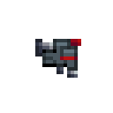
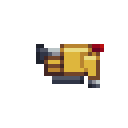
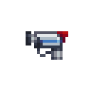
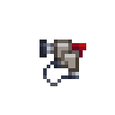
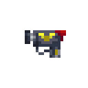

[ARGUS Station Database](../README.md) > [Personnel](README.md) > NIF Operation and Software

# NIF Operation and Software
### ARGUS Station Documentation: Nanite Implant Framework

The Nanite Implant Framework operates as a continuous background system once implanted and calibrated. It provides a heads-up interface, communicator integration, and a platform for software modules that extend its capabilities. This document covers NIF operation, the pre-installed software suite, department packages, and the full catalogue of available modules.

For hardware specifications and implantation procedures see [NIF Hardware](../Systems/Science/NIF.md) and [Surgery](../Systems/Medical/Surgery.md#nif-implantation).

## Operation

The NIF activates automatically after implantation and runs a calibration sequence. If the device has been used by a prior owner, calibration completes quickly. For a new owner on a fresh NIF, the calibration period is approximately fifteen minutes. During this time the device is functional but operating at reduced capacity. The NIF is fully operational once calibration completes.

The NIF's interface is accessed through an internal menu visible in the host's augmented reality overlay. Software modules appear as entries in this menu and can be activated from it.

The NIF consumes a small and continuous amount of power. Power draw increases with active software. Under normal circumstances a host's natural biological processes supply sufficient power; no external charging is required for organic hosts.

## Pre-Installed Software

All NIFs ship with the following three modules active.

| Module | Description |
|---|---|
| **Commlink** | An internal communicator linked to the station's communication network. The primary channel for private and department communication for NIF users. |
| **Soulcatcher** | A mind storage and processing system capable of housing one or more sapient minds in a contained virtual space. The host configures whether new arrivals are accepted; stored minds persist until released or the NIF is destroyed. |
| **AR Overlay (Civ)** | A general-purpose augmented reality overlay providing identification and basic health status readouts on visible personnel. |

## Department Software Packages

Department software packages are provided at no cost to qualifying personnel. Each package installs a set of modules suited to the role. Packages are delivered via NIFSoft uploader disk.

| | Department | Package Contents |
|:---:|---|---|
|  | Security | AR Overlay (Sec), Responsive Filter |
|  | Engineering | AR Overlay (Eng), Alarm Monitor, Nictating Membrane |
|  | Medical | AR Overlay (Med), Crew Monitor |
|  | Mining (organic) | Material Scanner, Respirocytes |
|  | Mining (synthetic) | Material Scanner, Pressure Seals, Heat Sinks |
|  | Pilot (organic) | Respirocytes |
|  | Pilot (synthetic) | Pressure Seals, Heat Sinks |

## Software Catalogue

Additional modules can be purchased or obtained through research. Each module is installed via NIFSoft uploader disk. Multiple modules can be active simultaneously subject to power availability.

### Vision and Perception

| Module | Description |
|---|---|
| **AR Overlay (Med)** | Civilian overlay extended with medical records access and pathogen database lookup. Issued with Medical package. |
| **AR Overlay (Sec)** | Civilian overlay extended with arrest status and security records access. Issued with Security package. |
| **AR Overlay (Omni)** | Combined overlay incorporating the features of both the medical and security variants. |
| **Corrective AR** | Compensates for common visual impairments including cataracts and retinal misalignment by adjusting the AR display layer. |
| **Meson Scanner** | Displays structural terrain and base geometry through walls. Equivalent to worn meson scanner goggles. |
| **Material Scanner** | Displays objects through walls. Equivalent to worn material scanner goggles. Issued with Mining package. |
| **Thermal Scanner** | Displays heat-emitting organisms through walls. Equivalent to worn thermal goggles. |
| **Low-Light Amp** | Amplifies available light to enable vision in complete darkness. Equivalent to worn night vision goggles. |
| **Nictating Membrane** | A synthetic third eyelid protecting the eyes from UV radiation and hostile atmospheric conditions. Does not protect against photonic stun weapons. Issued with Engineering package. |
| **Responsive Filter** | High-speed filter that activates on detection of intense light events such as flash weapons, blocking the effect. Issued with Security package. |

### Health and Endurance

| Module | Description |
|---|---|
| **Medichines (organic)** | An internal nanite swarm supporting tissue repair and physiological stability. Promotes healing under normal conditions and provides stabilization under critical injury. |
| **Medichines (synthetic)** | A swarm of mechanical repair nanites providing continuous minor repair to synthetic body components. Significant structural damage still requires manual intervention. |
| **Respirocytes** | Nanites that replicate red blood cell function, recycling available oxygen to temporarily sustain the host in atmosphere-deprived environments. Supplies oxygen only. Issued with Mining and Pilot organic packages. |
| **Mind Backup** | Stores a one-time snapshot of the host's current mindstate on activation. The backup persists until overwritten by a new activation. |

### Monitoring

| Module | Description |
|---|---|
| **Crew Monitor** | A direct link to station crew sensor data, allowing tracking of personnel status across the station. Issued with Medical package. |
| **Alarm Monitor** | A direct link to station alarm systems for remote situational awareness. Issued with Engineering package. |

### Protection and Combat

| Module | Description |
|---|---|
| **Bullhide Mod** | Reinforces the dermis and skeletal structure at the nanoscale, improving resistance to physical trauma. |
| **Dragon's Skin** | A sub-dermal thermal dispersal layer reducing damage from laser weapons and fire exposure. Provides no protection against sustained environmental heat. |
| **Nova Shock** | Continuous high-grade painkiller delivery system suppressing pain response entirely. High risk of dependency and overdose with prolonged use. |
| **Bloodletters** | Generates monofilament wires from the fingertips capable of penetrating most armour. Wires consume power and require periodic replacement. |
| **Dazzle** | Fabricates a concealed two-shot holdout laser internally. Single fabrication only; materials are not replenished after use. |

### Utility

| Module | Description |
|---|---|
| **APC Connector** | Allows synthetic hosts to recharge internal power systems directly from APC units. |
| **Pressure Seals** | Creates pressure isolation around critical synthetic components, protecting them against vacuum exposure. Minimally effective for organic hosts. Issued with Mining and Pilot synthetic packages. |
| **Heat Sinks** | Advanced internal heat storage for synthetic hosts, holding excess heat until a safe environment for venting is available. Issued with Mining and Pilot synthetic packages. |
| **Mass Alteration** | Enables significant alteration of the host's physical mass and size through internal rearrangement. Causes accelerated device wear during and after use. |

### Restricted

| Module | Description |
|---|---|
| **Compliance Module** | A law-application system capable of imposing behavioural directives on sapient beings. Possession and use are prohibited under station regulations and applicable law. |

*All entries compiled from direct station system analysis. ARGUS.*
