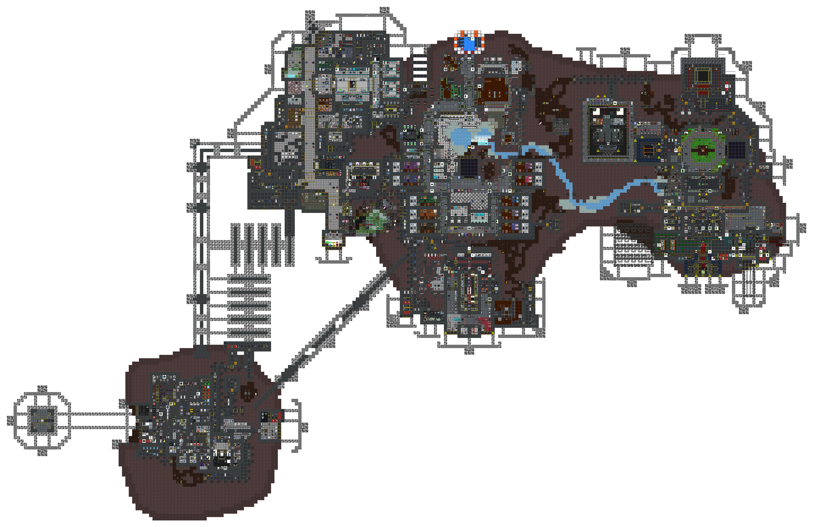
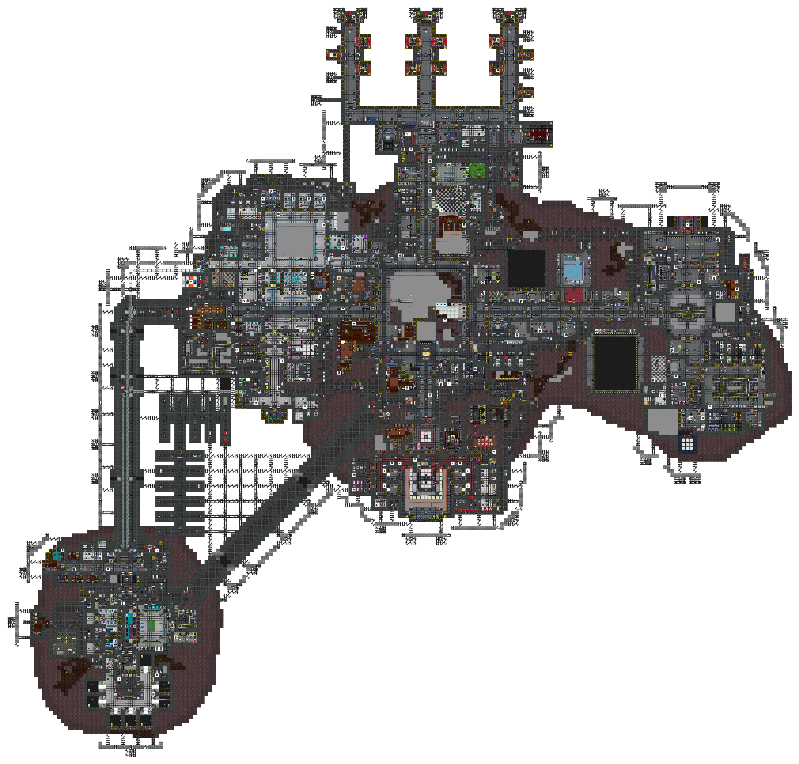
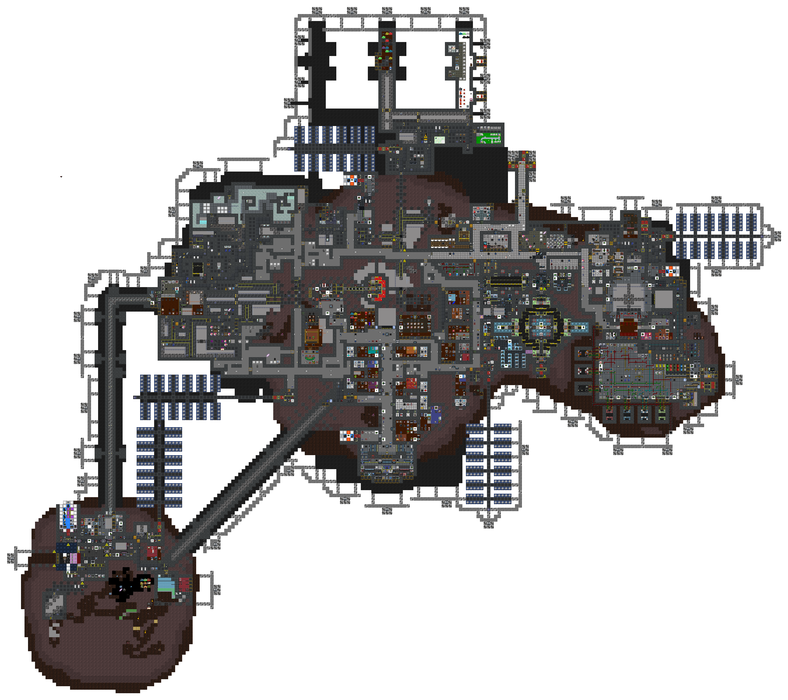
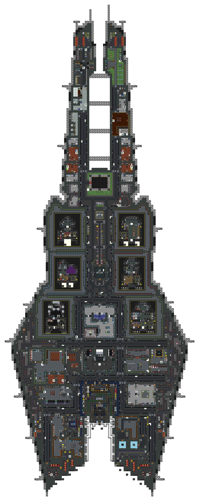
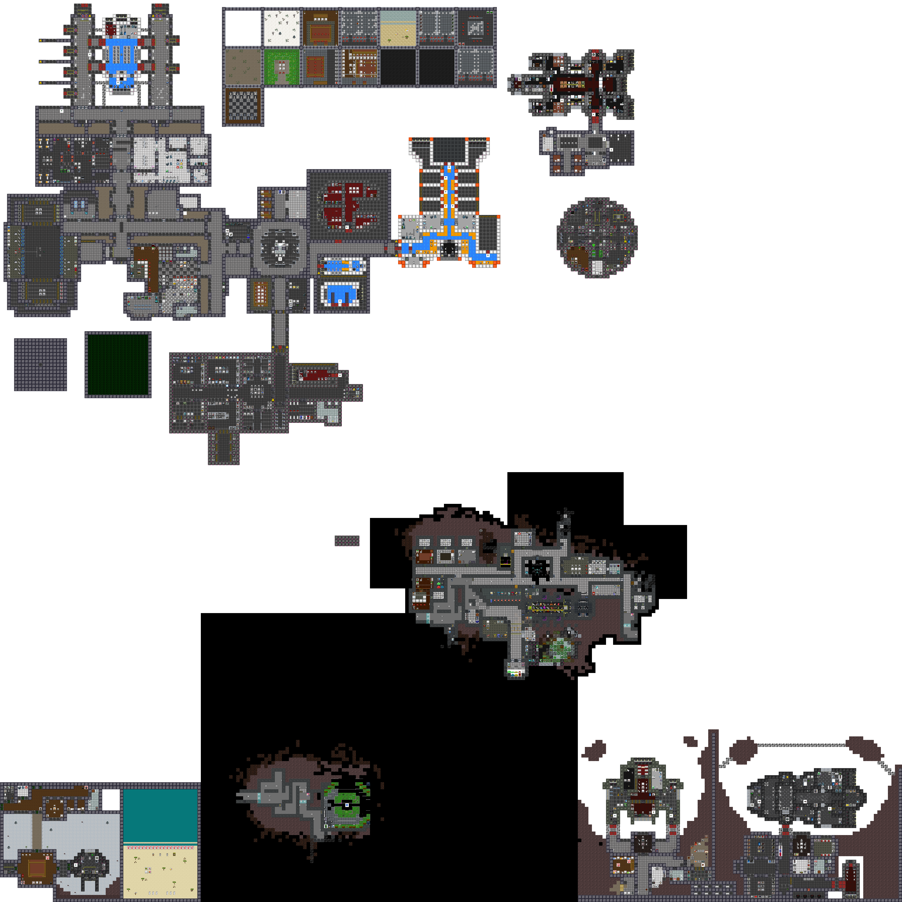
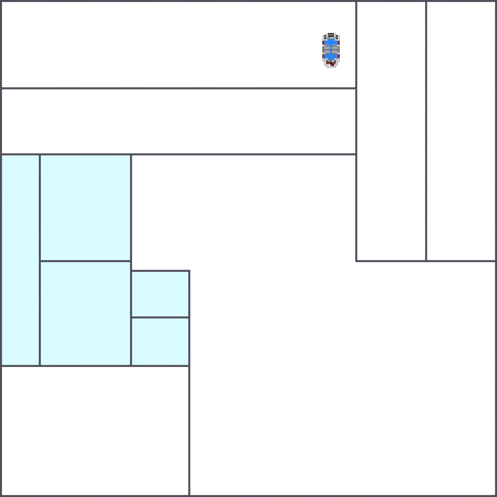

# Cetus Station

**Designation:** NLS Cetus
**Type:** Asteroid-embedded station
**Levels:** 3 station decks; exploration outpost; off-station approaches; transit

Cetus is an asteroid-excavated station. The station interior is carved into and built around the asteroid body, giving it an irregular organic outline compared to constructed stations. A dedicated exploration outpost operates separately from the main decks and serves as the staging point for carrier expeditions.

---

## Station Decks

### Deck 1

Main inhabited level. Contains the primary departments: medical, science, command, security, and crew quarters. The asteroid exterior wraps the station body on this level; maintenance corridors follow the rock contour.

---

### Deck 2

Secondary station level. Contains additional departmental areas, maintenance infrastructure, and engineering systems including the supermatter engine.

---

### Deck 3

Third station level. Contains storage, additional maintenance access, and lower engineering infrastructure.

---

## Exploration Outpost

A self-contained exploration staging facility operating alongside the main station. Houses multiple carrier hangars, a Combat Information Center, RnD, medical, security, and crew accommodations. Serves as the departure and recovery point for long-range carrier expeditions.

---

## Off-station Approaches

Off-station arrival and departure space. Contains Central Command facilities and approach corridors used by shuttles transiting to and from the station.

---

## Shuttle Transit

In-flight transit space traversed by shuttles during departure and arrival. No fixed installations. Escape pods and passenger shuttles pass through this region in transit.

---

*Surveys conducted by ARGUS.*
