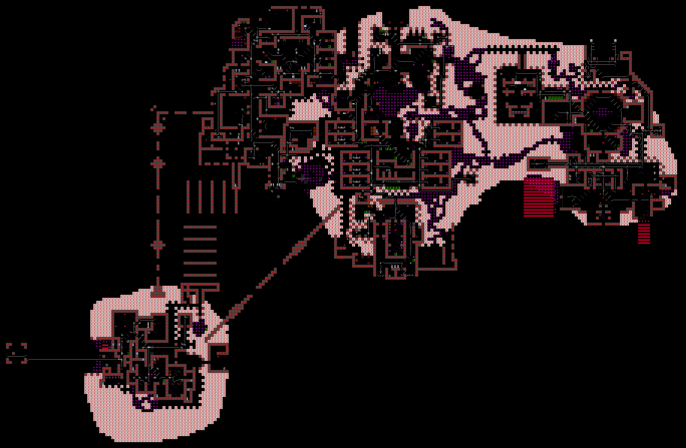
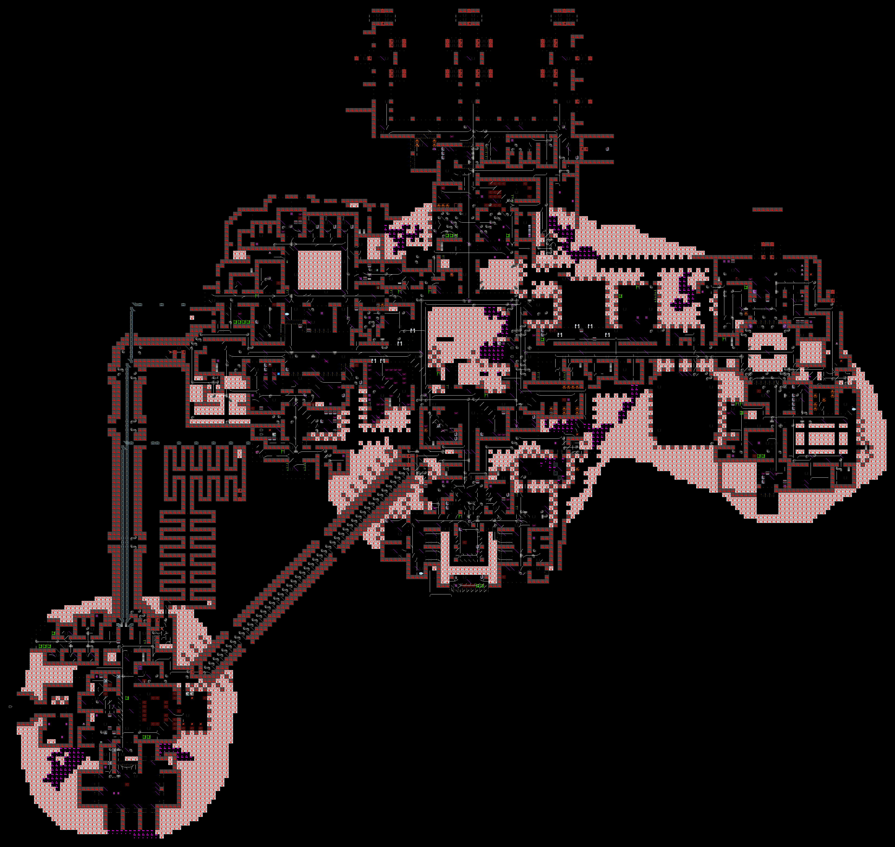
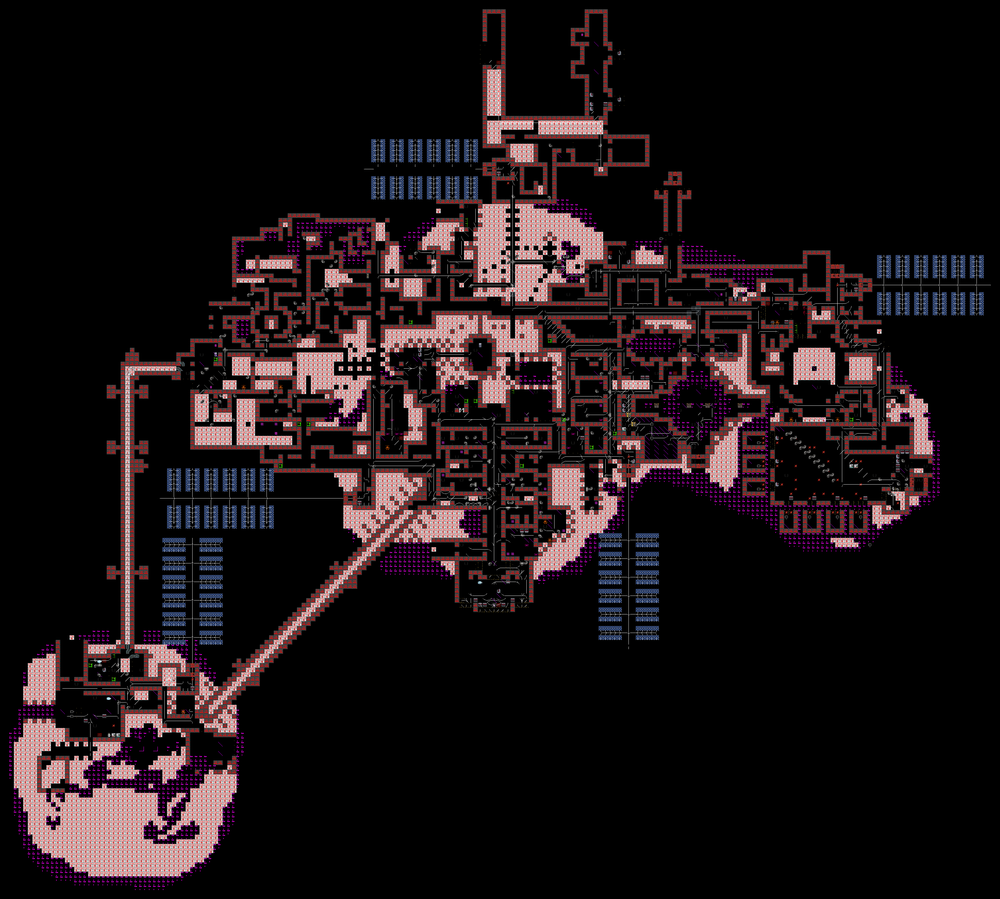
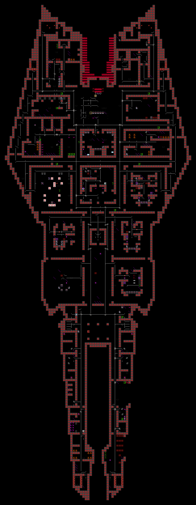
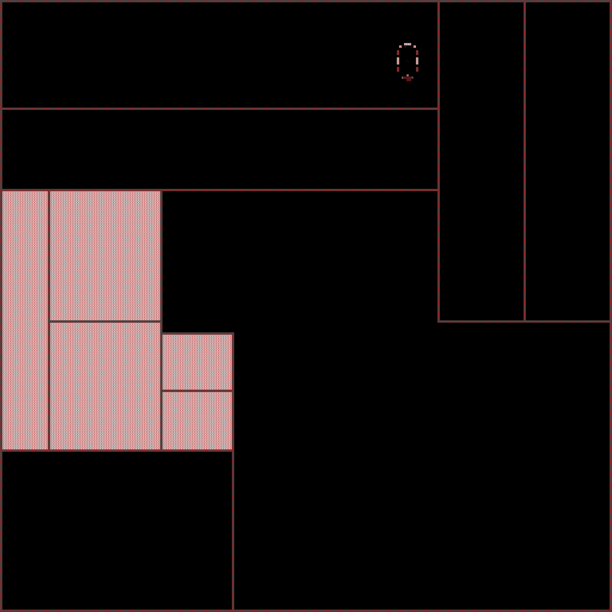

# Cetus Station

**Designation:** NLS Cetus
**Type:** Asteroid-embedded station
**Z-levels:** 6 (three station decks; surface, surface mines, surface wilds)

Cetus is an asteroid-excavated station. The station interior is carved into and built around the asteroid body, giving it an irregular organic outline compared to constructed stations. Surface access and mining operations take place across dedicated Z-levels above the main decks.

---

## Station Decks

### Deck 1 (Z1)

Main inhabited level. Contains the primary departments: medical, science, command, security, and crew quarters. The asteroid exterior wraps the station body on this level; maintenance corridors follow the rock contour.

---

### Deck 2 (Z2)

Secondary station level. Contains additional departmental areas, maintenance infrastructure, and engineering systems including the supermatter engine.

---

### Deck 3 (Z3)

Third station level. Contains storage, additional maintenance access, and lower engineering infrastructure.

---

## Surface Levels

### Surface (Z6)

The asteroid exterior and surface installations. Access points to the surface from the main station body are located here. Surface suits required.

---

### Surface Mines (Z7)

Active mining tunnels and excavation areas within the asteroid.

---

### Surface Wilds (Z8)

Unexcavated or wilderness regions of the asteroid exterior.

---

*Maps rendered from source DMM data. ARGUS.*
