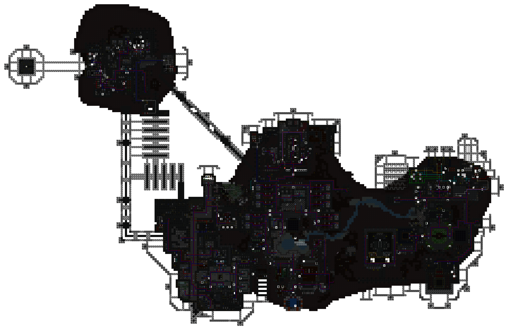
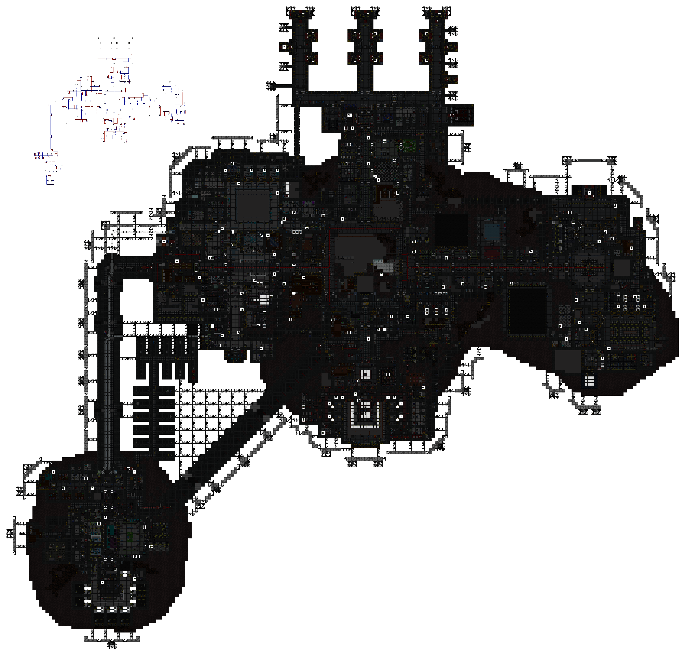
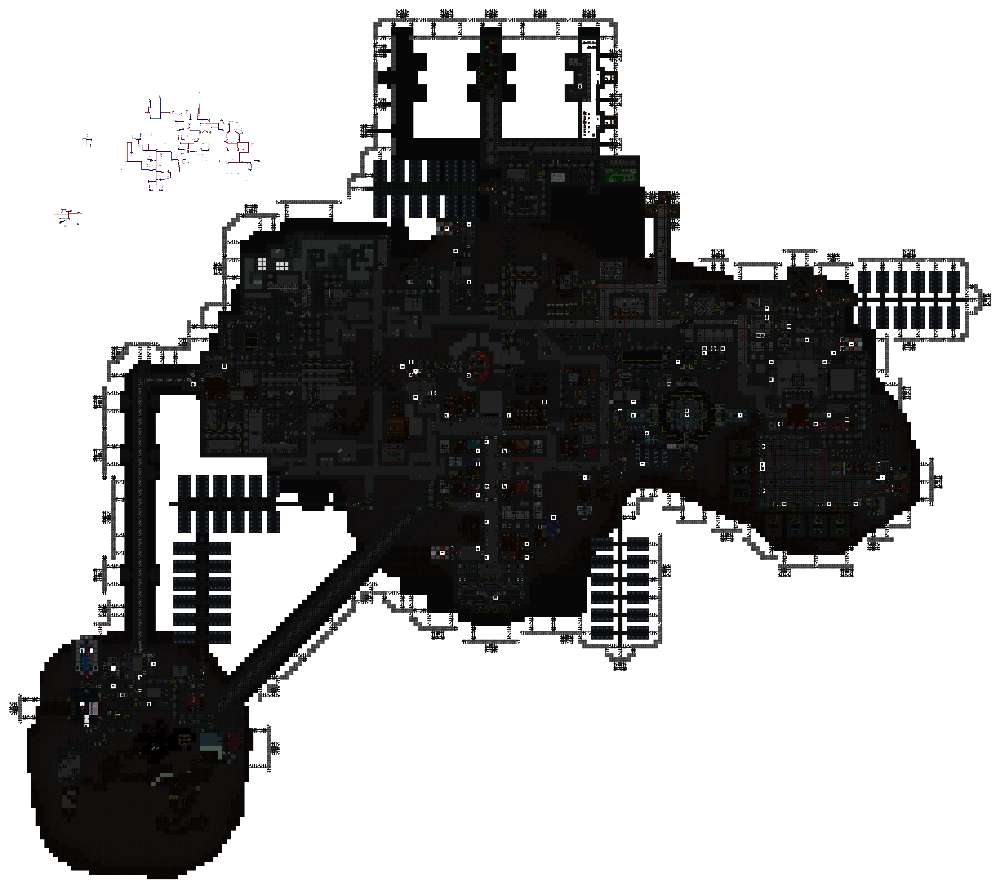
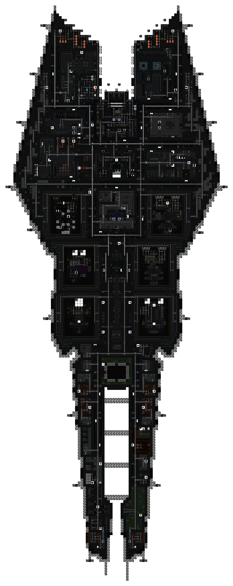

[ARGUS Station Database](../../../README.md) > [Stations](../../) > [Cetus](../) > Atmospheric Pipes

# Cetus: Atmospheric Pipe Network

Overlay maps showing the atmospheric distribution network for each station level. Covers pressurized piping, vent pumps, scrubbers, and binary/trinary junctions. Hidden under-floor pipes are included.

**Levels:** [Deck 1](#deck-1) | [Deck 2](#deck-2) | [Deck 3](#deck-3) | [Exploration Outpost](#exploration-outpost-surface)

### Deck 1

### Deck 2

### Deck 3

### Exploration Outpost (Surface)

*Surveys conducted by ARGUS.*
