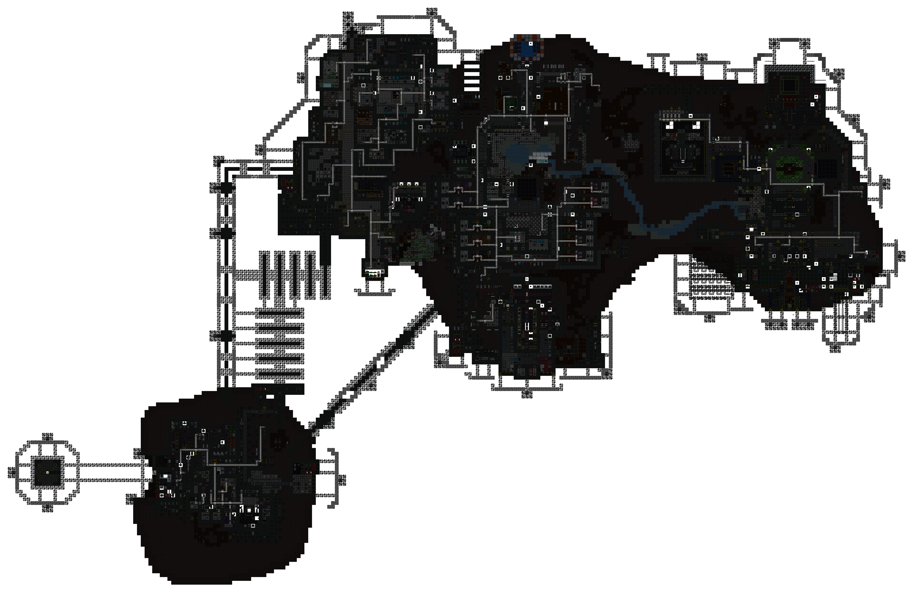
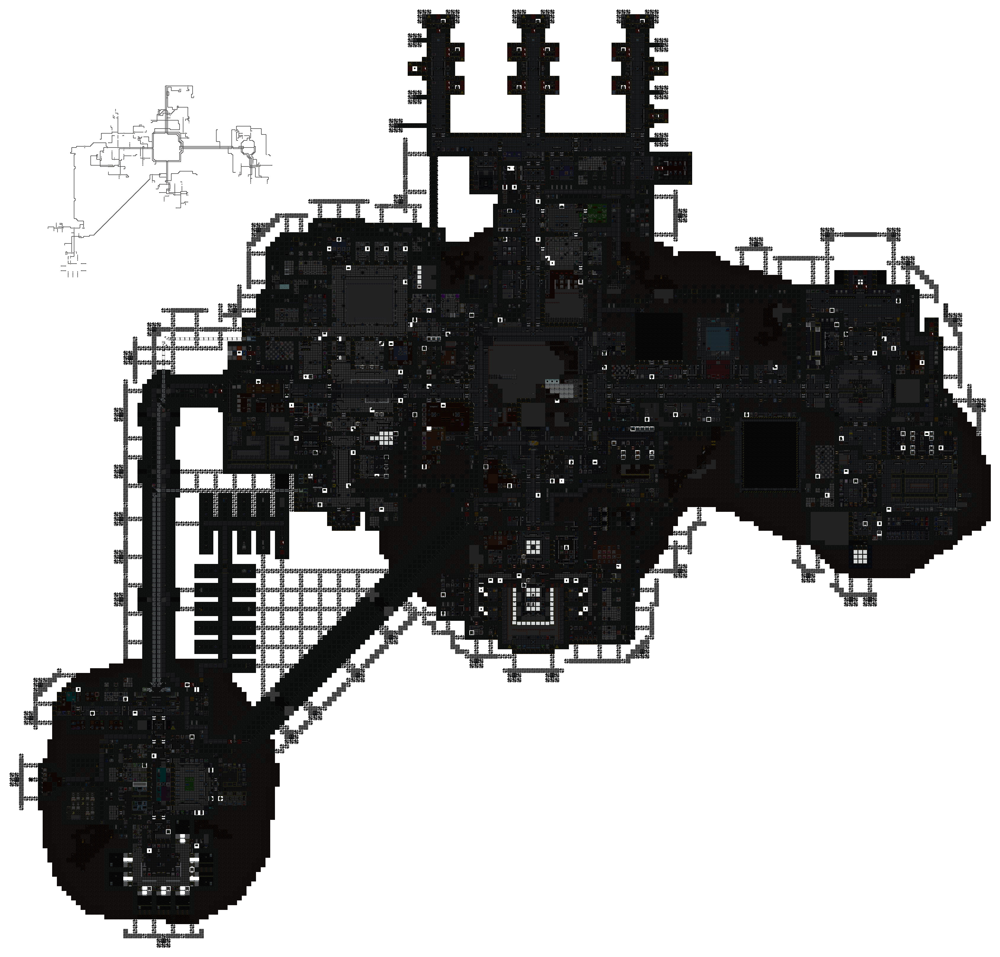
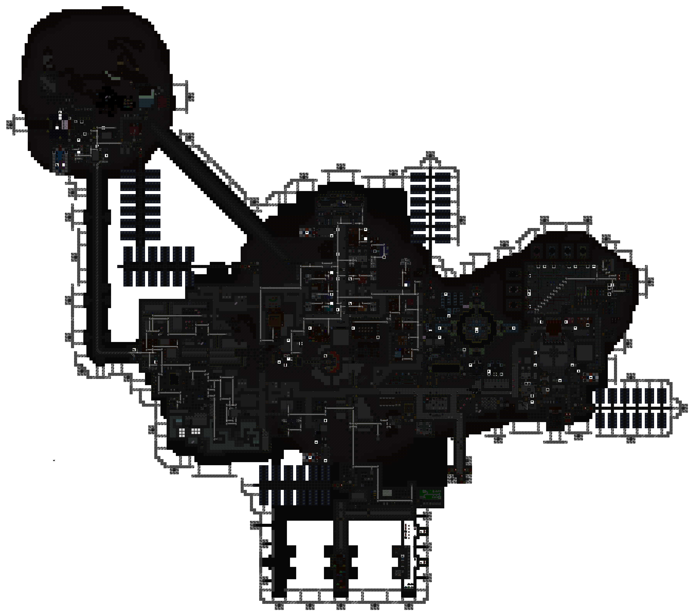
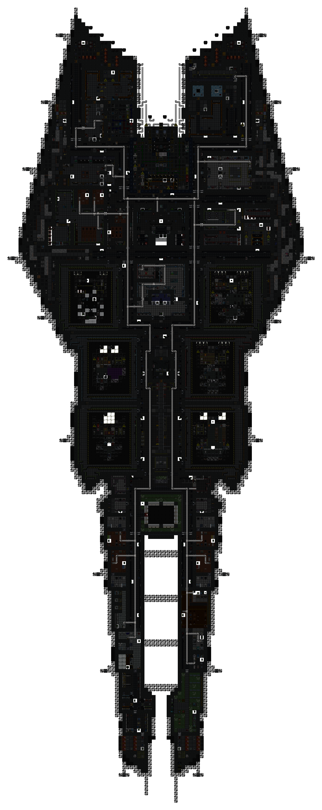

[ARGUS Station Database](../../../README.md) > [Stations](../../) > [Cetus](../) > Disposal Pipes

# Cetus: Disposal Pipe Network

Overlay maps showing the pneumatic disposal pipe routing for each station level.

**Levels:** [Deck 1](#deck-1) | [Deck 2](#deck-2) | [Deck 3](#deck-3) | [Exploration Outpost](#exploration-outpost-surface)

---

### Deck 1

---

### Deck 2

---

### Deck 3

---

### Exploration Outpost (Surface)

---

*Surveys conducted by ARGUS.*
