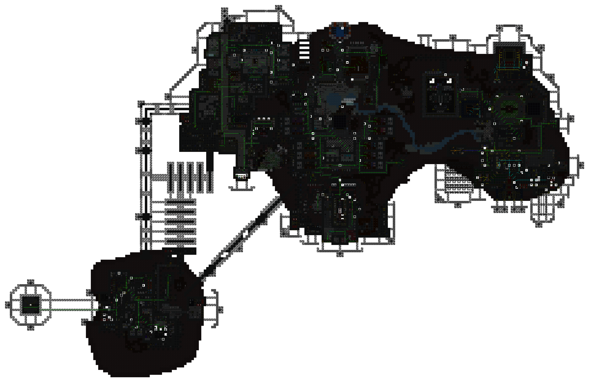
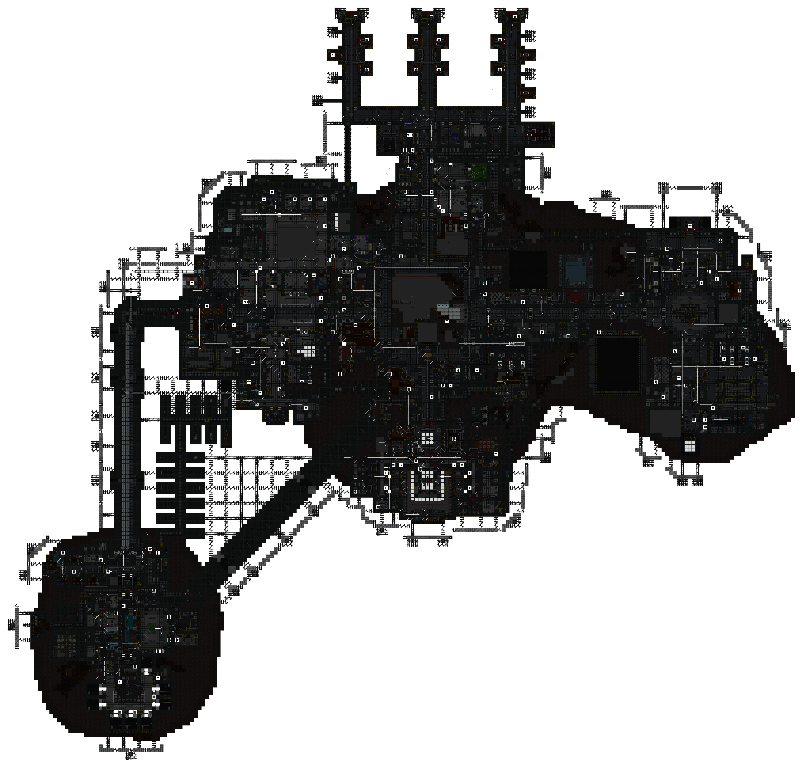
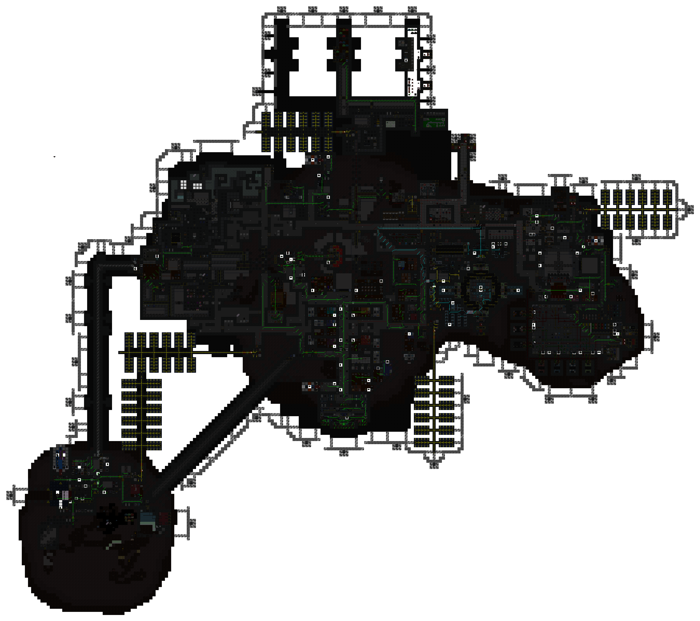
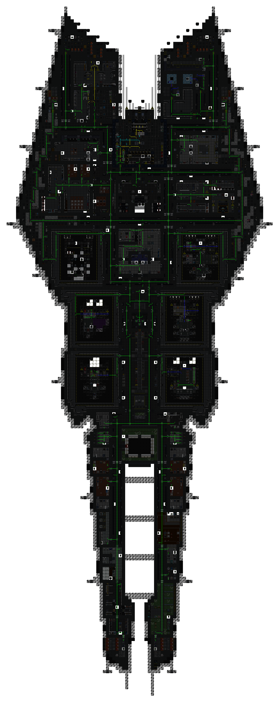

[ARGUS Station Database](../../../README.md) > [Stations](../../) > [Cetus](../) > Electrical Wiring

# Cetus: Electrical Wiring

Overlay maps showing cable routing for each station level.

**Levels:** [Deck 1](#deck-1) | [Deck 2](#deck-2) | [Deck 3](#deck-3) | [Exploration Outpost](#exploration-outpost-surface)

### Deck 1

### Deck 2

### Deck 3

### Exploration Outpost (Surface)

*Surveys conducted by ARGUS.*
