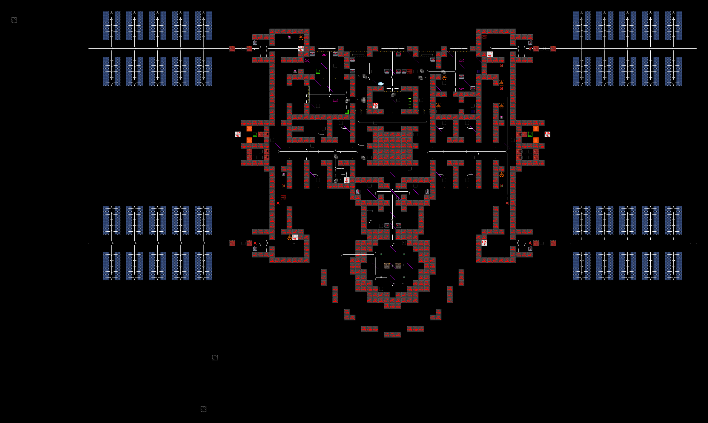
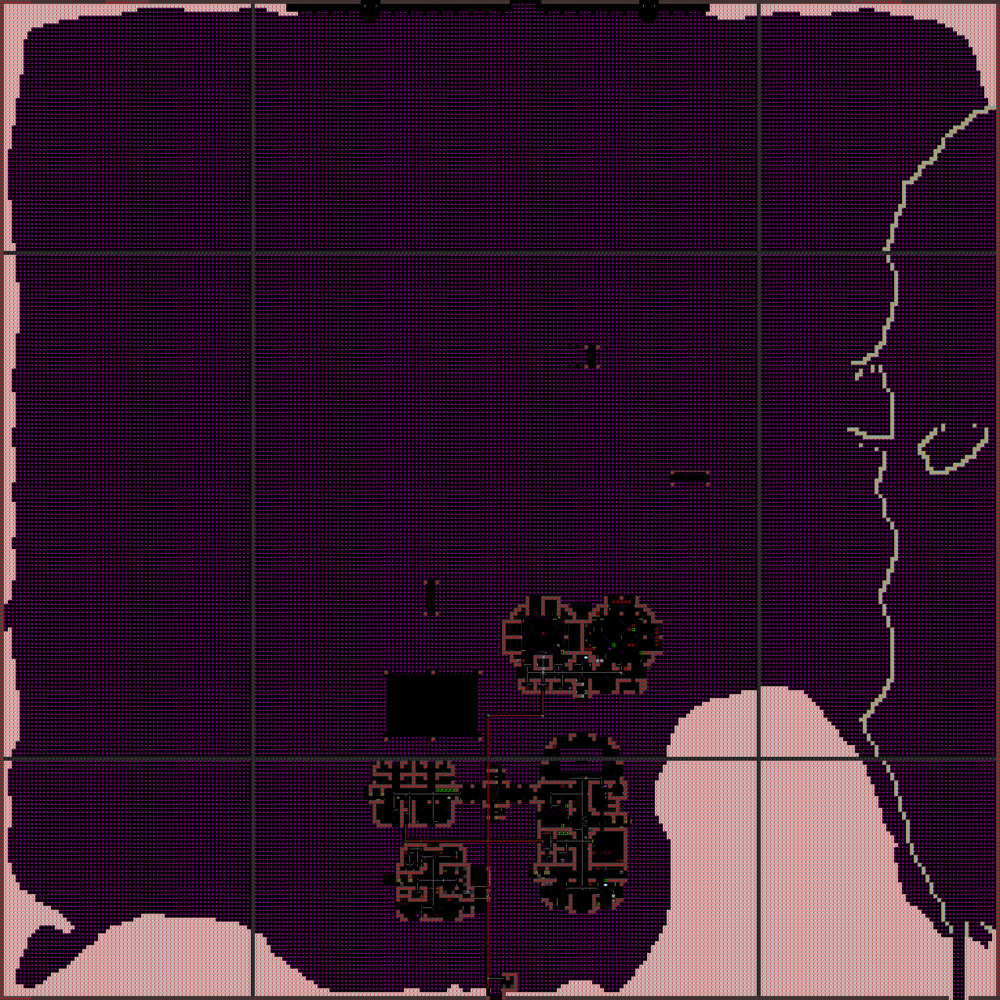
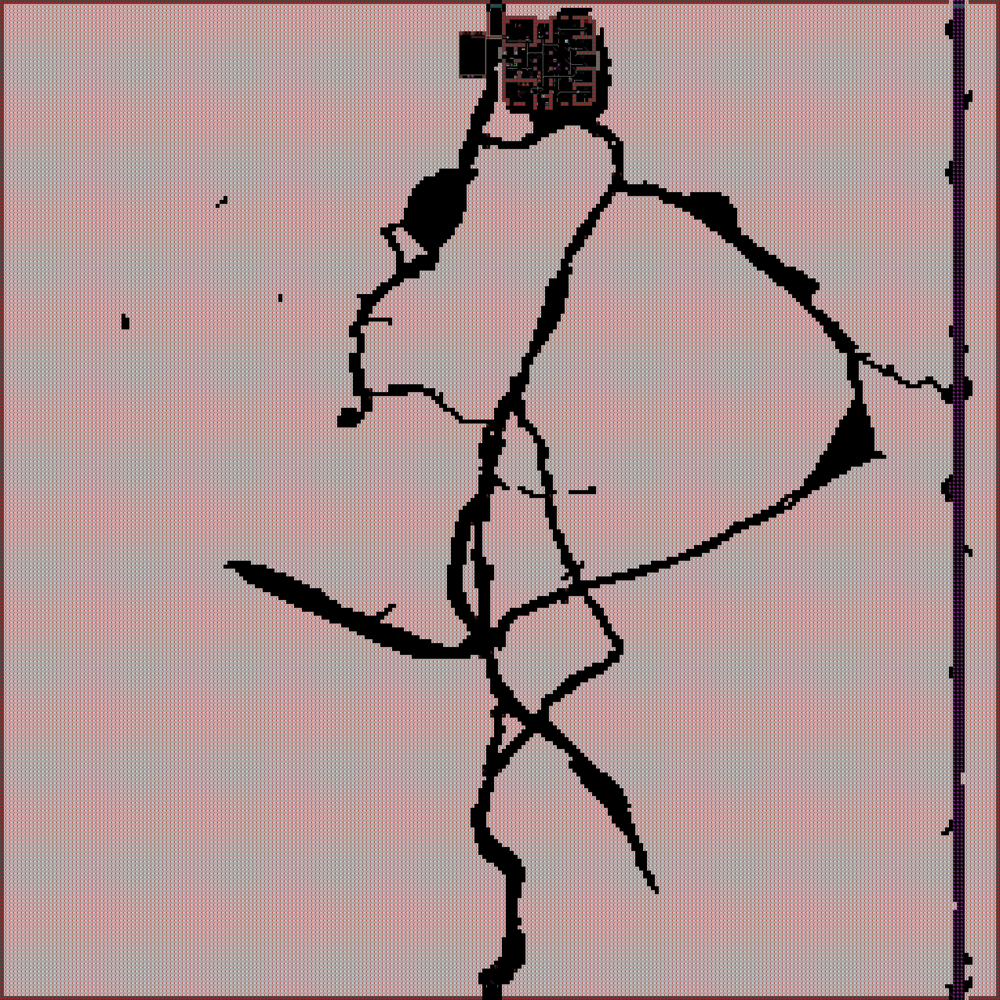

# Southern Cross Station

**Designation:** NLS Southern Cross
**Type:** Constructed space station
**Z-levels:** 3 primary decks; surface and surface mines

Southern Cross is a compact purpose-built space station. Unlike the asteroid-embedded Cetus, Southern Cross is a freestanding constructed platform in open space. The station has a bilateral symmetry with solar arrays extending to either side of the central body.

---

## Station Decks

### Deck 1 (Z1)

Primary station level. Contains the main inhabited areas, departmental offices, and primary access corridors. Solar arrays extend to port and starboard on this level.

---

### Deck 3 (Z3)

Third station level. Contains additional departmental and engineering infrastructure.

---

### Empty Space / Solars (Z4)

Solar array fields and open space surrounding the station exterior.

---

### Surface Mines (Z6)

Mining and surface operations level.

---

*Maps rendered from source DMM data. ARGUS.*
