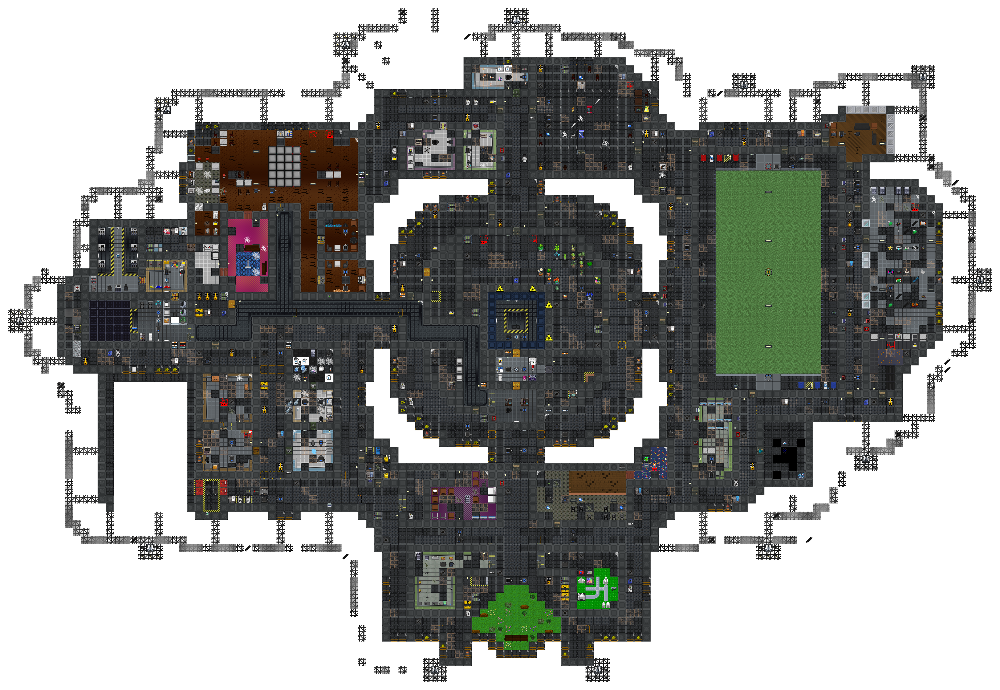
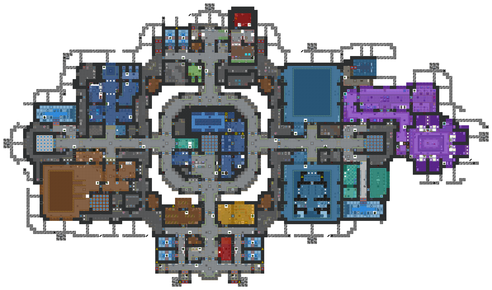
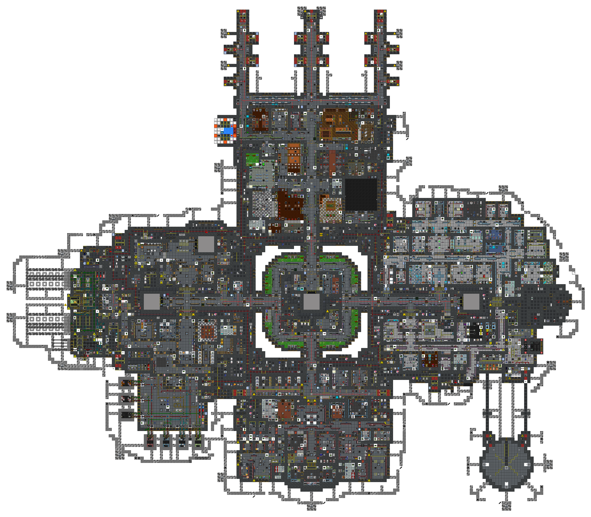
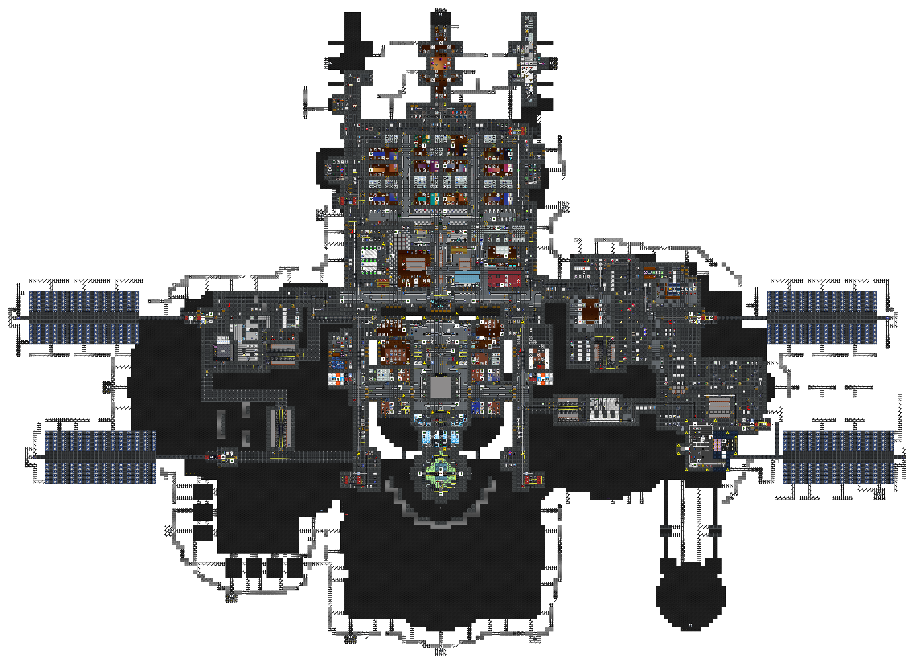
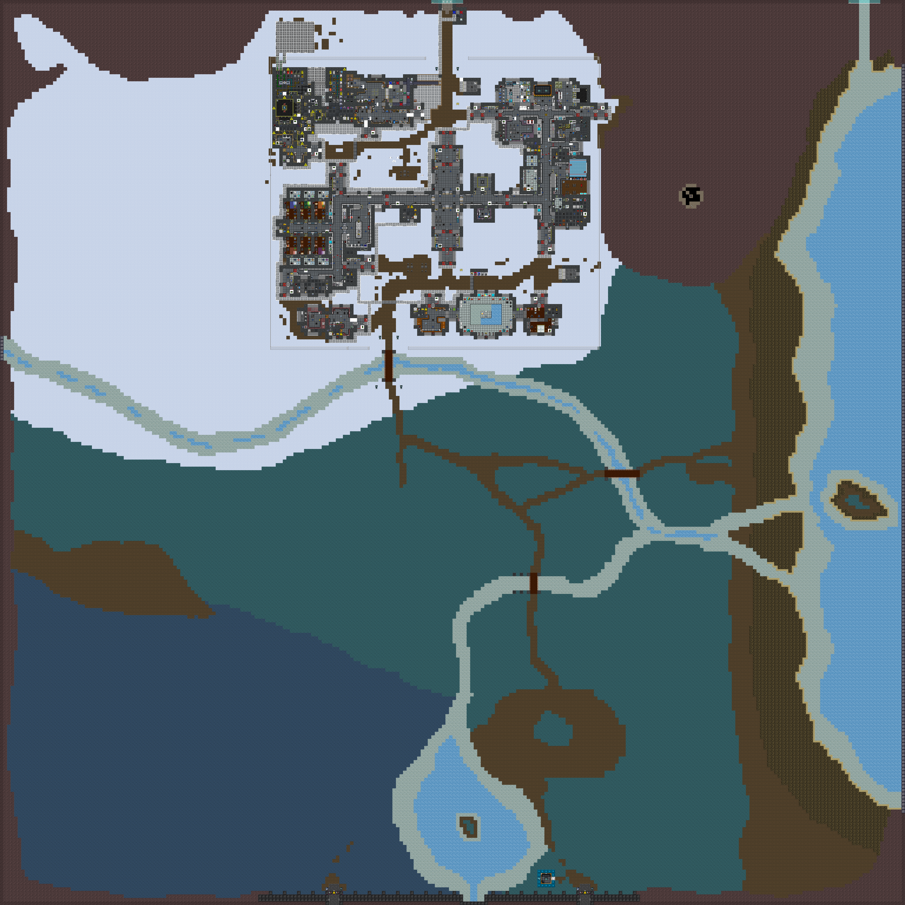
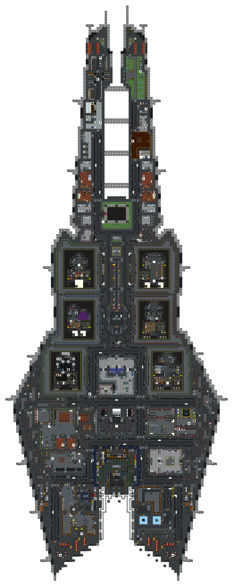

[ARGUS Station Database](../../README.md) > [Stations](../) > Southern Cross

# Southern Cross Station

**Designation:** NLS Southern Cross
**Type:** Constructed space station with planetside installations
**Levels:** Zero Deck; First Deck; Second Deck; Third Deck; planet surface; planetside mine; experimental outpost

Southern Cross is a purpose-built space station in orbit above a habitable planet. The station consists of four stacked decks connected by turbolifts and maintenance ladders. Planetside operations include a staffed surface outpost and an extensive underground mine and research facility.

## Zero Deck

The maintenance underbelly of the station. Houses the gravity generator complex, backup power systems, and an extensive network of maintenance corridors running beneath the operational decks. Includes the field sports hall, a small bar lounge, and various utility spaces accessed through maintenance hatches from the decks above.

## First Deck

The lower operational level. Contains the primary hangars, cargo and quartermaster operations, xenobiology and xenoflora research, teleporter bay, and auxiliary engineering. The central atrium turbolift connects all four decks. Multiple escape pod bays and large hangar bays for visiting and resident craft are located on this level.

## Second Deck

The main operational deck. Hosts all major station departments: engineering (including the engine room and atmospherics), medical, security, research and development, bar and kitchen, hydroponics, chapel, library, and holodeck facilities. Head-of-staff offices for most departments are located here. The engine room and its waste systems extend to port on this level.

## Third Deck

The uppermost station level. Contains the Bridge, AI Core, crew dormitories, head-of-staff quarters, and the station gateway. Solar array wings extend along the cardinal axes. The exterior hull on this level is reinforced airless plating.

## Planet Surface

Planetside surface installations on the planet below. The environment includes open plains, mountains, river systems, and coastal areas. Built structures include the main outpost (housing, bar, gym, security, garage, gateway, and medical), a xenobiology and xenoflora research complex, and the North Mining Outpost with its refinery.

## Planetside Mine

The cave and tunnel network beneath the planet surface. Comprises extensive explored and unexplored cave systems, the Xenoarcheology facility (with anomalous materials lab, sample analysis, and isolation chambers), and the underground extension of the North Mining Outpost.

## Experimental Outpost

A self-contained outpost structure, separate from the main station. Houses a full complement of departments including a Combat Information Center, AI core, engineering with an onboard reactor, medical bay and surgical suite, research and development, security with armory, bar and kitchen, botany, and exploration briefing and staging facilities. Six numbered hangars plus a dedicated staging hangar accommodate a standing fleet of resident shuttles. Accessible via the station gateway or direct shuttle approach.

## Infrastructure Layers

| Layer | Survey |
|---|---|
| Electrical wiring | [wiring/](wiring/) |
| Disposal pipes | [disposals/](disposals/) |
| Atmospheric pipes | [atmos/](atmos/) |

## Other Stations

| Station | Type |
|---|---|
| [Cetus](../Cetus/) | Asteroid-embedded station |

*Surveys conducted by ARGUS.*
