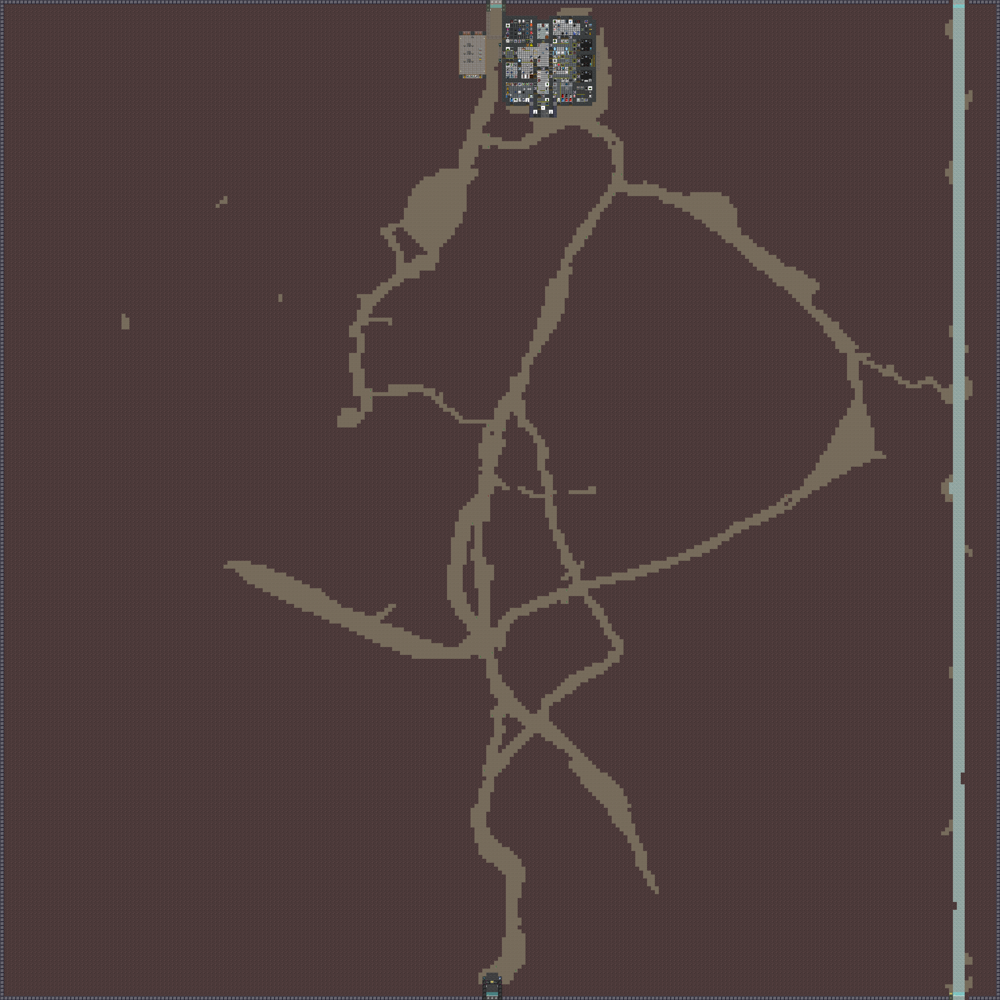
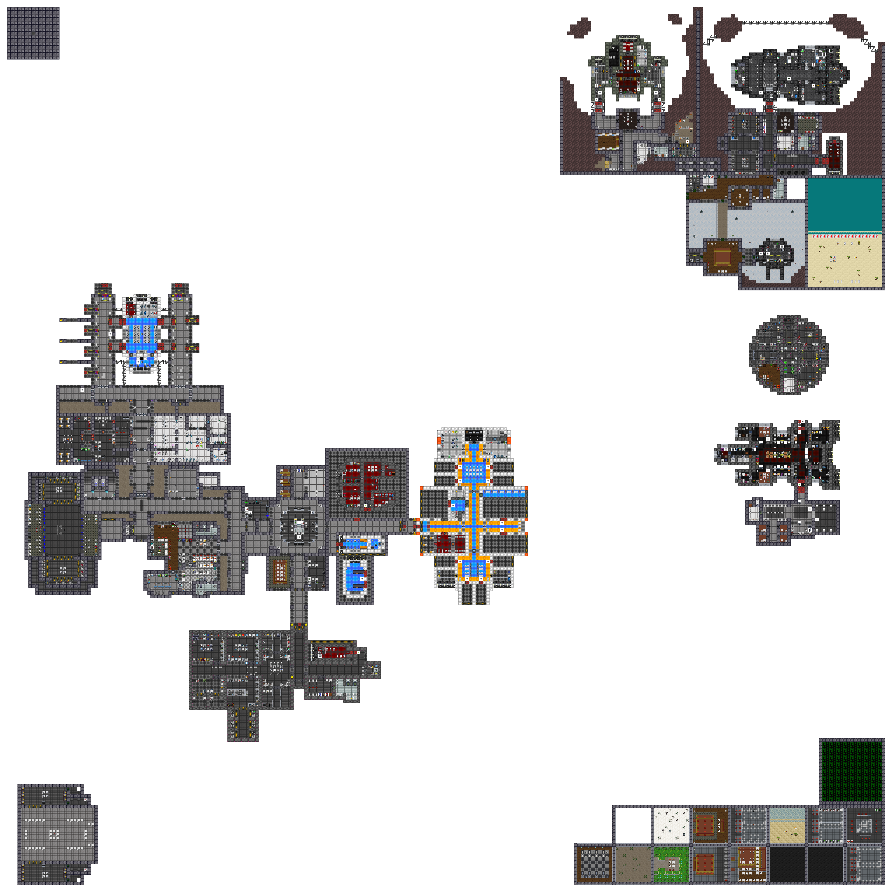

# Southern Cross Station

**Designation:** NLS Southern Cross
**Type:** Constructed space station
**Levels:** 3 station decks; solar arrays; surface mines

Southern Cross is a compact purpose-built space station. Unlike the asteroid-embedded Cetus, Southern Cross is a freestanding constructed platform in open space. The station has a bilateral symmetry with solar arrays extending to either side of the central body.

---

## Station Decks

### Deck 1

Primary station level. Contains the main inhabited areas, departmental offices, and primary access corridors. Solar arrays extend to port and starboard on this level.

---

### Deck 3

Third station level. Contains additional departmental and engineering infrastructure.

---

## Exterior

### Solar Arrays

Solar array fields and open space surrounding the station exterior.

---

### Surface Mines

Mining and surface operations level.

---

*Surveys conducted by ARGUS.*
