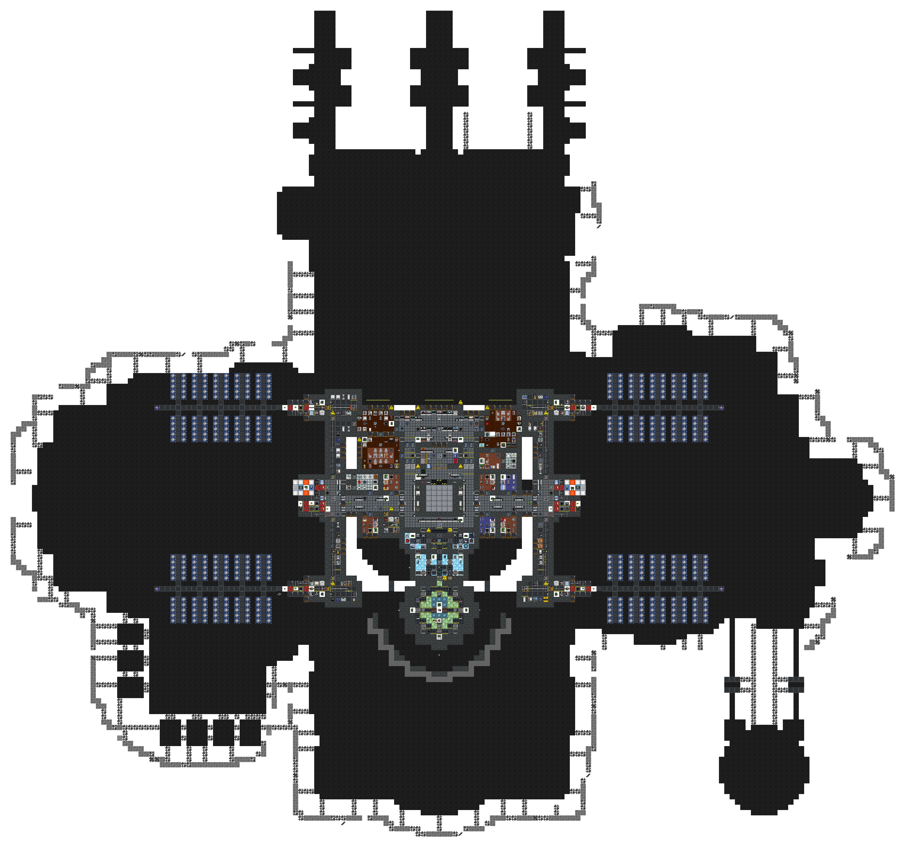
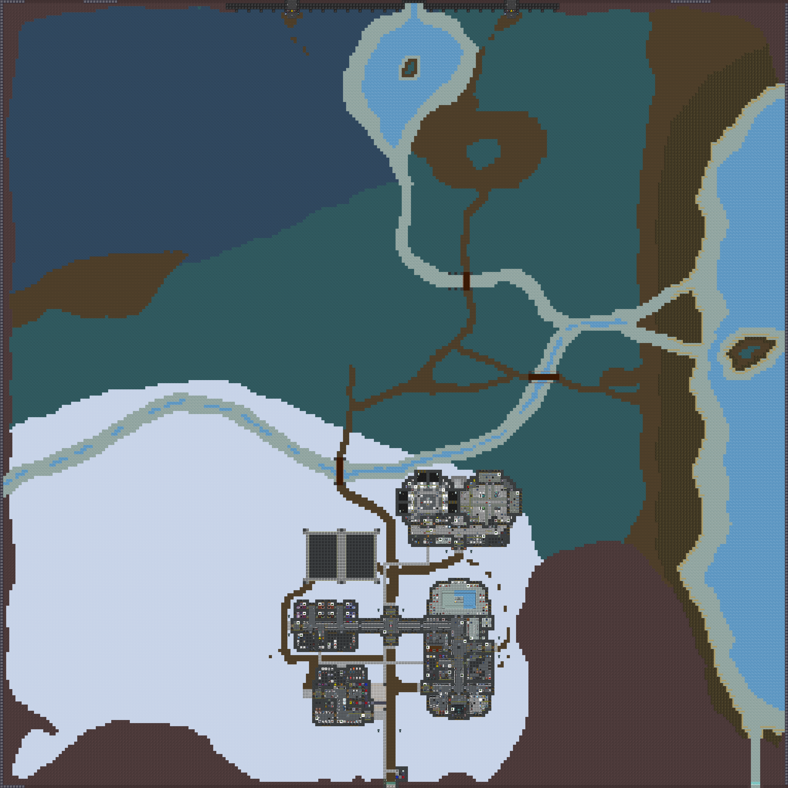

# Southern Cross Station

**Designation:** NLS Southern Cross
**Type:** Constructed space station with planetside installations
**Levels:** Main station deck; planet surface; planetside mine

Southern Cross is a purpose-built space station in orbit above a habitable planet. The station maintains a bilateral symmetry with solar arrays extending to port and starboard. Planetside operations include a staffed surface outpost and an extensive underground mine and research facility.

---

## Station Deck

Primary station level. Contains the Bridge, AI Core, command offices, and solar array access corridors. Solar arrays extend to port and starboard on this level.

---

## Planet Surface

Planetside surface installations on the planet below. The environment includes open plains, mountains, river systems, and coastal areas. Built structures include the main outpost (housing, bar, gym, security, garage, gateway, and medical), a xenobiology and xenoflora research complex, and the North Mining Outpost with its refinery.

---

## Planetside Mine

The cave and tunnel network beneath the planet surface. Comprises extensive explored and unexplored cave systems, the Xenoarcheology facility (with anomalous materials lab, sample analysis, and isolation chambers), and the underground extension of the North Mining Outpost.

---

*Surveys conducted by ARGUS.*
