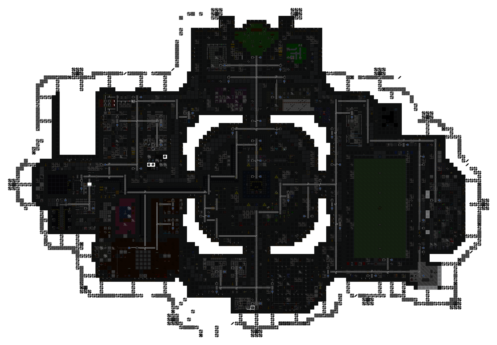
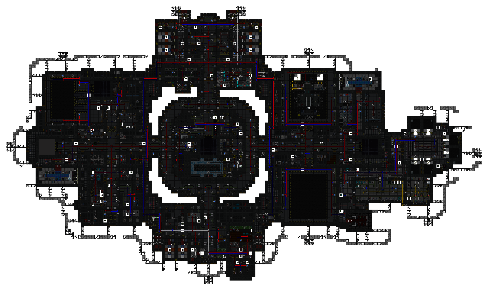
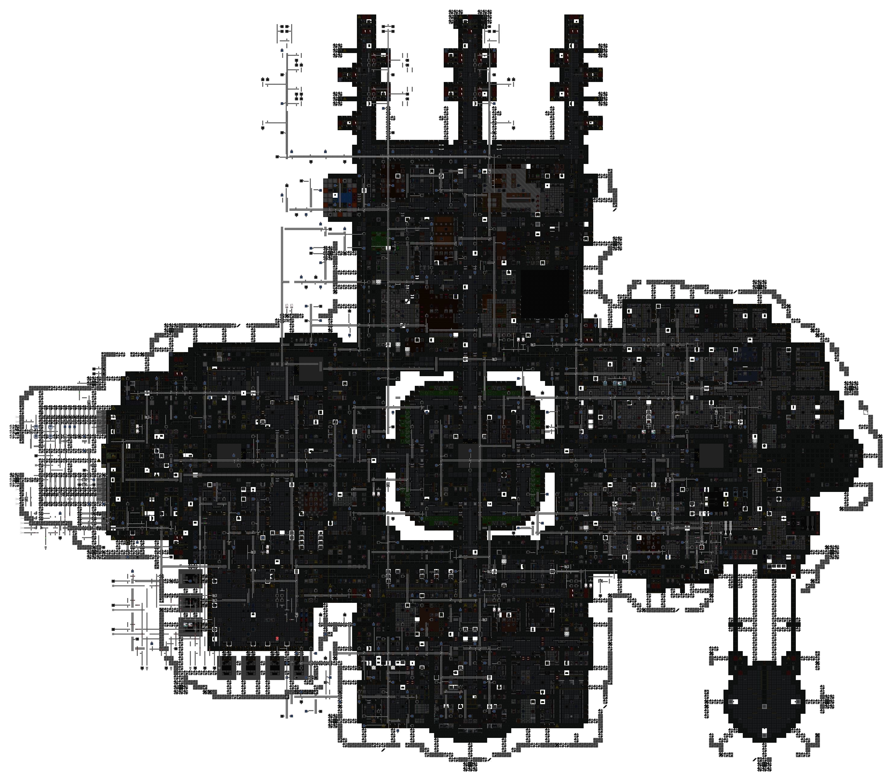
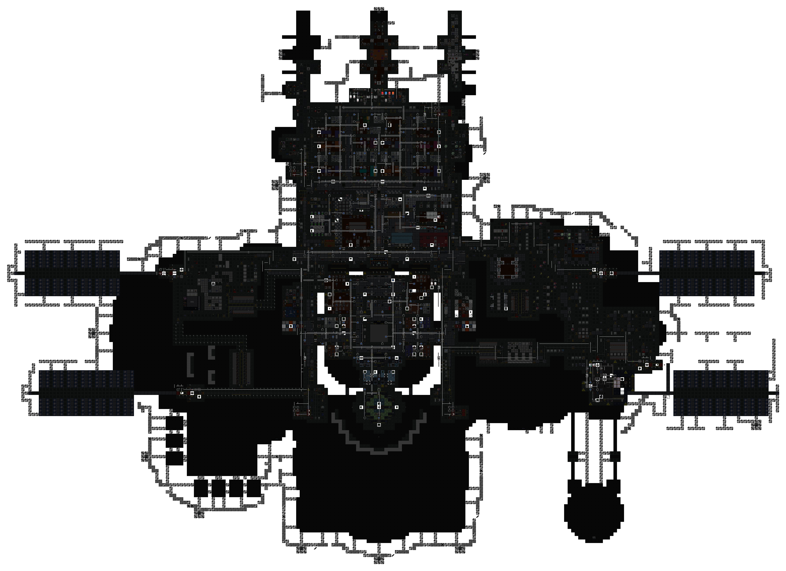

[ARGUS Station Database](../../../README.md) > [Stations](../../) > [Southern Cross](../) > Atmospheric Pipes

# Southern Cross: Atmospheric Pipe Network

Overlay maps showing the atmospheric distribution network for each station deck. Covers pressurized piping, vent pumps, scrubbers, and binary/trinary junctions. Hidden under-floor pipes are included.

**Decks:** [Zero Deck](#zero-deck) | [First Deck](#first-deck) | [Second Deck](#second-deck) | [Third Deck](#third-deck)

### Zero Deck

### First Deck

### Second Deck

### Third Deck

*Surveys conducted by ARGUS.*
