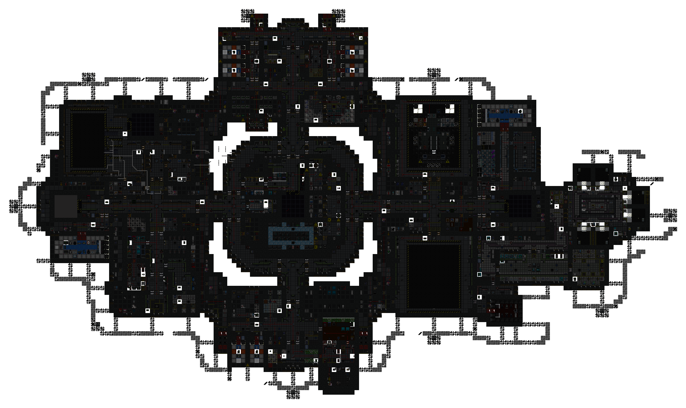
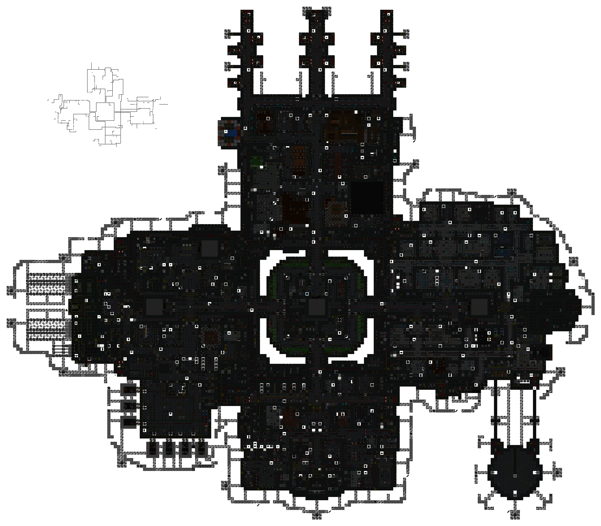
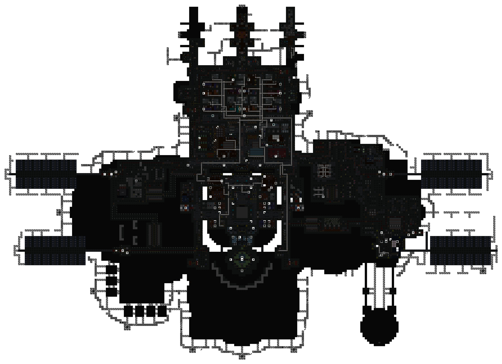

[ARGUS Station Database](../../../README.md) > [Stations](../../) > [Southern Cross](../) > Disposal Pipes

# Southern Cross: Disposal Pipe Network

Overlay maps showing the pneumatic disposal pipe routing for each station deck. Zero Deck has no disposal infrastructure.

**Decks:** [First Deck](#first-deck) | [Second Deck](#second-deck) | [Third Deck](#third-deck)

---

### First Deck

---

### Second Deck

---

### Third Deck

---

*Surveys conducted by ARGUS.*
