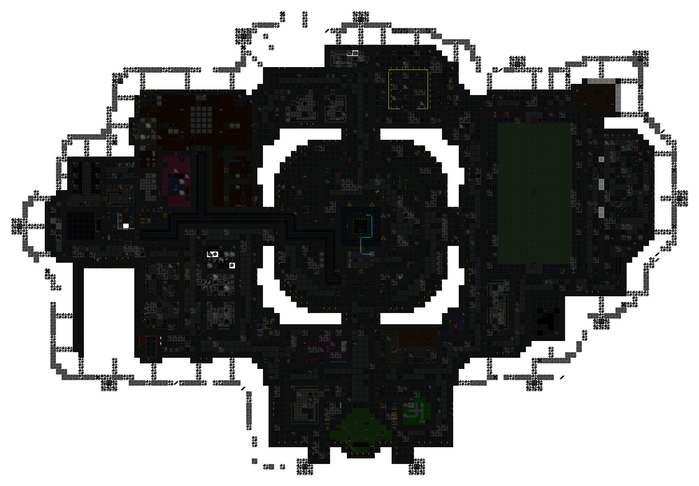
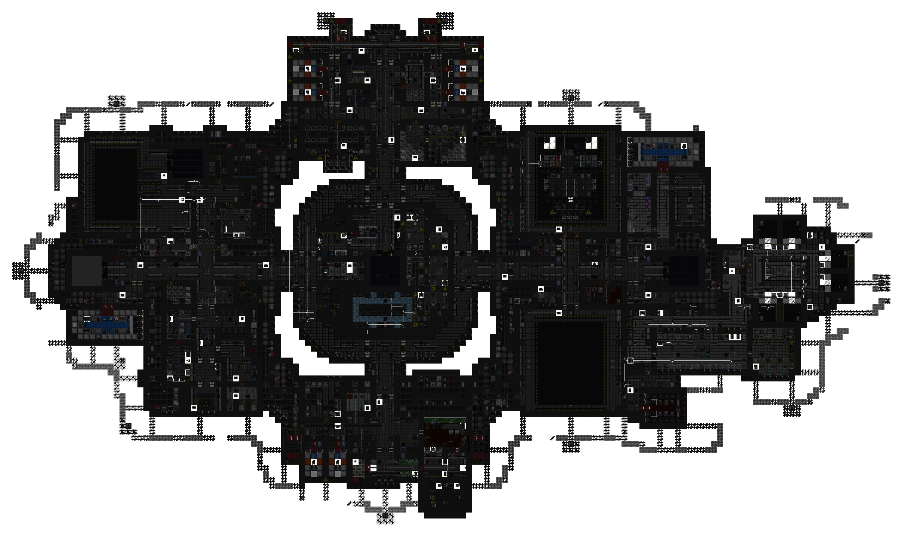
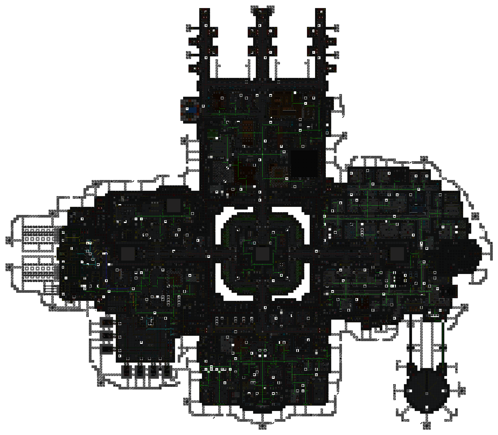
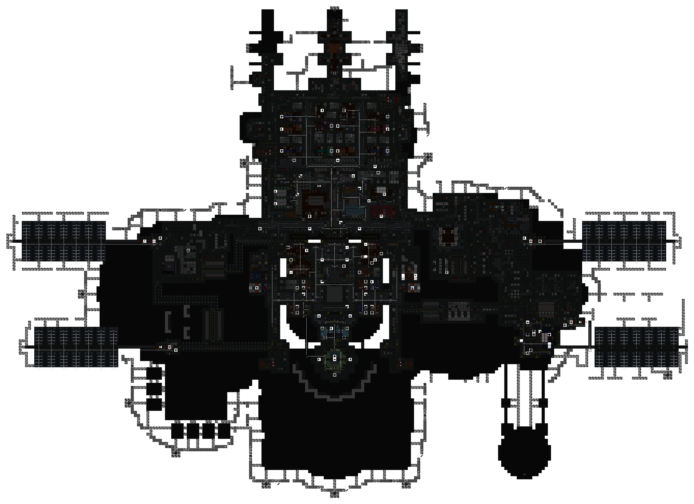

[ARGUS Station Database](../../../README.md) > [Stations](../../) > [Southern Cross](../) > Electrical Wiring

# Southern Cross: Electrical Wiring

Overlay maps showing cable routing for each station deck.

**Decks:** [Zero Deck](#zero-deck) | [First Deck](#first-deck) | [Second Deck](#second-deck) | [Third Deck](#third-deck)

---

### Zero Deck

---

### First Deck

---

### Second Deck

---

### Third Deck

---

*Surveys conducted by ARGUS.*
