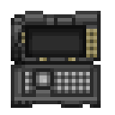
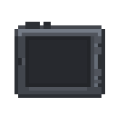
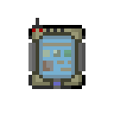

[ARGUS Station Database](../../README.md) > [Systems](../README.md) > [Command](README.md) > Paperwork System

# Paperwork System

Station bureaucratic infrastructure: the full set of tools for producing, reproducing, distributing, organizing, and destroying physical documents.

---

## Quick Reference

| Item | Function | Notable |
|---|---|---|
| [Paper bin](#paper) | Dispenses blank paper | Up to 30 sheets; regular or carbon-copy |
| [Regular paper](#paper) | Write, stamp, copy, fax | Can be folded into hat |
| [Carbon-copy paper](#paper) | Produces one gray duplicate on separation | Cannot be bundled until separated |
| [Pen (black/blue/red)](#pens) | Write on paper | Belt/ear storage; included with every PDA |
| [Fountain pen](#pens) | Write on paper | Several visual variants |
| [Multi-pen](#pens) | Write in black, blue, or red | Cycles on activation |
| [Crayon/Marker](#pens) | Write in color | 30 uses; distinct style |
| [Chameleon pen](#pens) | Write under a custom signature | Signature set on activation |
| [Stamp](#stamps) | Marks documents as approved/denied/department-issued | Copies show gray silhouette only |
| [Paper bundle](#paper-bundles) | Groups multiple sheets | Up to any size; navigable by page |
| [Folder](#folders) | Holds papers, photos, bundles | Multiple colors; belt-storable |
| [Clipboard](#clipboards) | Portable writing surface | Holds pen; belt-storable |
| [Filing cabinet](#filing-cabinets) | Stores documents in bulk | Security/medical variants print records on first access |
| [Photocopier](#photocopier) | Duplicates documents | Toner-dependent; 40 max toner |
| [Fax machine](#fax-machine) | Transmits documents to other departments or off-station | Auth required; 3-min cooldown for CentCom |
| [Paper shredder](#paper-shredder) | Destroys documents | 10-unit capacity; excess sprays floor |
| [Hand labeler](#hand-labeler) | Appends text labels to objects | 30 uses |
| [NanoWord](#nanoword) | Digital word processor on laptops, tablets, consoles | Supports full markup; can print via nano printer |
| [PDA Notekeeper](#pda-notekeeper) | Personal notes on PDA | 12 named slots; can print to paper |

---

## Paper

**Standard paper** is dispensed from paper bins as blank sheets. When taken from a bin the crew member is offered a choice between regular paper and carbon-copy paper.

**Carbon-copy paper** appears as a stack of two sheets. Text written on the top sheet is mirrored onto the lower copy in gray. The copy is separated by tearing it away from the original once writing is complete. Once separated, the original and the copy are independent items. Carbon copies cannot be added to a paper bundle until they have been separated.

**Paper bins** hold up to 30 sheets and accept paper returned to them. The amount remaining is shown on examination.

**Cards** are a variant of paper used for written greetings. They function identically to paper but cannot be folded.

Paper can be written on, stamped, photocopied, faxed, bundled, folded into a hat, filed, and shredded. A blank sheet can be folded into a paper hat and worn on the head. Paper with written content has a distinct appearance from blank paper.

---

## Writing Instruments

### Pens

Standard pens write in black ink. Blue and red variants are available. Pens can be stored on belt or worn behind the ear. Every PDA issued to crew comes with a pen inserted in the side; the pen can be removed and used independently, and a replacement pen can be inserted into an empty PDA.

**Fountain pens** are higher-quality writing instruments available in several styles. They function identically to standard pens but are favored by command and administrative staff for their appearance.

**The multi-pen** cycles between black, blue, and red ink by activating it while held. The pen's appearance changes to reflect the active color.

**Crayons** write in the crayon font and their specific color. Available in a wide range of colors. 30 uses per crayon. Markers function similarly with a chisel-tip style.

**The chameleon pen** can be set to display any custom signature, allowing documents to be signed under a different name. Signature is set by activating the pen.

### Writing on Paper

Applying a pen to paper opens a writing prompt. Three text styles are available: a standard upright print font, a cursive font used for signature fields, and the crayon style when using crayons. Text length is limited per sheet. Available space decreases as content is added; the remaining space is tracked.

Paper written by hand supports the same markup codes as NanoWord. See [Document Markup Codes](#document-markup-codes) for the full tag reference.

Paper can accept stamps while writing is in progress. Stamps added before text is complete will appear on the document.

---

## Stamps

Stamps are applied by pressing a held stamp against a paper or paper bundle. Each stamp leaves a visible impression on the document.

The following stamps are available on station:

| | Stamp | | Stamp |
|:---:|---|:---:|---|
|  | Site Manager |  | Head of Personnel |
|  | Head of Security |  | Warden |
|  | Chief Engineer |  | Research Director |
|  | Chief Medical Officer |  | Talon |
|  | Quartermaster |  | Cargo |
|  | Internal Affairs |  | Clown |
|  | DENIED |  | ACCEPTED |

External organization stamps occasionally found on incoming documents:

| | Stamp | | Stamp |
|:---:|---|:---:|---|
|  | Central Command |  | Sol Government |
|  | Sol Government (logo) |  | Einstein Engines |
|  | Hephaestus Industries |  | Zeng-Hu Pharmaceuticals |

A **chameleon stamp** can be configured to mimic any known stamp type.

**Photocopied stamps** reproduce as simplified gray impressions that indicate a stamp was present but do not show the original mark clearly.

---

## Paper Bundles

Multiple sheets of paper and photographs can be clipped together into a **paper bundle**. To create a bundle, place a second sheet of paper onto an existing sheet while holding it.

Bundles can be navigated page by page. Pages can be added, removed individually, or reordered. Holding a sheet of paper while turning to the next or previous page inserts the sheet at that position. Two bundles can be merged by placing one onto the other.

Bundles can be named. Individual pages within a bundle can also be renamed.

A bundle can be disbanded, dropping all pages loose to the floor.

Bundles can be photocopied, faxed, stored in folders, filed in cabinets, and shredded. The shredder treats a bundle as three units of capacity.

---

## Folders

Folders hold papers, photographs, and paper bundles. They can be carried on the belt or worn in a holster.

Available colors: standard (tan), blue, red, yellow, white. Department-specific variants with identifying markings exist for the Site Manager, Head of Personnel, Chief Medical Officer, Research Director, Chief Engineer, and Head of Security.

Labeling a folder with a pen sets a visible name on the folder.

Opening a folder displays its contents. Individual papers, photographs, and bundles can be read, viewed, renamed, or removed from within.

---

## Clipboards

A clipboard holds paper and photographs and can store a pen clipped to its side. The topmost paper is visible on the clipboard face.

Writing on clipped paper can be done while the sheet remains in place. The clipboard can be worn on the belt.

---

## Filing Cabinets

Filing cabinets store papers, folders, photographs, and bundles. Three physical variants are available: a standard horizontal drawer cabinet, a taller standing cabinet, and a chest drawer.

Opening a cabinet displays all stored items, from which items can be removed one at a time. Items on the floor near a cabinet can be pushed inside without opening it first.

**Security record cabinets** in the Security department are pre-configured to generate printed security records for all crew members on demand when first opened. Each record includes name, ID, fingerprint, physical and mental status, criminal status, and logged notes.

**Medical record cabinets** in Medical operate the same way, generating printed medical records including blood type, DNA, disabilities, allergies, active diseases, and medical log entries.

---

## Photocopier

The photocopier reproduces papers, photographs, and paper bundles. Place the document into the machine, set the copy count (up to 10), and activate the copy function.

**Toner** is the consumable resource for all copies. The machine holds up to 40 units. Single papers use 1 unit per copy. Photographs use 5 units. Bundles consume 1 unit per page per copy.

With plentiful toner, copies are rendered in dark ink close to the original. When toner runs low (below 10 units), copies are produced in lighter gray. When toner reaches zero, the machine stops and a red indicator light activates. A toner cartridge restores 30 units and can only be inserted when the machine is at 10 or below.

Copies of stamped documents carry simplified gray stamp silhouettes at the original positions. The specific stamp type is not legible in the copy; only the impression shape is retained (circular for command/CentCom marks, square for Talon, X for DENIED, dotted for all others).

The photocopier hardware is shared with the fax machine; both are housed in the same unit.

---

## Fax Machine

The fax machine transmits documents to fax machines in other departments, and to off-station recipients.

**Authentication:** Insert an ID card into the machine to log in. The machine verifies access and stores the sender's name and rank. Synthetic units can authenticate directly without a card. The card can be removed after authentication is complete.

**Sending a document:** Place a paper, photograph, or bundle into the machine. Select a destination department from the list, which shows all departments with active fax machines registered on the network, then transmit.

If the destination machine is powered and operational, the document is received as a copy at the other end. The original remains in the sending machine.

**Destinations:** Any department with an active fax machine appears in the list. The following off-station destinations route to Central Command administration and require authentication:

- Central Command (NanoTrasen authority)
- Solar Central Government
- Supply (off-station supply authority)
- Talon Headquarters

Faxes sent to these destinations carry a 3-minute cooldown before another can be sent from the same machine.

Before sending to an off-station destination, the machine will prompt to rename the document if its title is still the default. Renaming improves routing clarity.

**Staff request:** The fax machine includes an automated crew request function. Opening the staff request form displays a list of requestable roles. Select a role and provide a reason; the request is relayed to the relevant department. There is a 5-minute global cooldown on automated requests.

**Document naming:** A document's name as set on the sheet or bundle is the title used in fax routing. Renaming via the machine only affects the current transmission, not the document itself.

---

## Paper Shredder

The paper shredder permanently destroys documents fed into it. Compatible items: papers, photographs, paper bundles, ID cards, and newspapers.

Capacity is tracked. Standard items consume 1 unit of capacity; larger items (bundles, ID cards, newspapers) consume 3 units. Maximum capacity is 10 units. If capacity is exceeded the machine ejects shredded paper debris across the floor.

**Emptying:** The bin can be emptied to collect the shredded contents. Shredded paper strips can be gathered into a storage container. They can also be burned if needed.

The shredder is powered by the equipment power circuit and will not operate without power.

---

## Hand Labeler

The hand labeler applies text labels to objects. Activate it and set the label text, then press it against objects to apply. The label is appended to the object's name in parentheses.

The labeler has 30 uses per device. It cannot label living crew members or silicons. Chemical containers are also excluded (label them with a pen instead).

The hand labeler can rename inactive synthetic platforms if the user has appropriate access.

---

## NanoWord

**NanoWord** is the standard word processing program found on laptop computers, tablet computers, and consoles throughout the station. It is available under the Office category in the program launcher and does not require a NTNet connection to operate.

NanoWord supports creating, editing, saving, and loading text documents stored on the device's hard drive. Documents can also be loaded from and saved to a portable drive if one is connected. The program renders documents for reading. A preview of the rendered output can be opened alongside the editor at any time.

**Printing:** If the device has a nano printer installed, NanoWord can print the open document directly to paper. The nano printer is a small integrated hardware module with its own paper buffer, holding up to 10 sheets. Blank paper can be fed into the printer to refill it. A damaged printer may produce partially obscured output.

NanoWord uses the same markup codes as physical paper. The holographic paper clip assistant built into the program displays the full tag reference on request.

### Document Markup Codes

The following formatting codes are recognized by NanoWord and by the station's paper rendering system. They work identically whether written by hand on physical paper or composed digitally in NanoWord.

**Text formatting**

| Tag | Effect |
|---|---|
| `[b]` ... `[/b]` | Bold |
| `[i]` ... `[/i]` | Italic |
| `[u]` ... `[/u]` | Underlined |
| `[large]` ... `[/large]` | Larger text |
| `[small]` ... `[/small]` | Smaller text |
| `[h1]` ... `[/h1]` | First-level heading |
| `[h2]` ... `[/h2]` | Second-level heading |
| `[h3]` ... `[/h3]` | Third-level heading |

**Layout**

| Tag | Effect |
|---|---|
| `[br]` | Line break |
| `[hr]` | Horizontal rule |
| `[center]` ... `[/center]` | Centered text |

**Lists**

| Tag | Effect |
|---|---|
| `[list]` ... `[/list]` | Bulleted list container |
| `[*]` | List item (used inside a list) |

**Tables**

| Tag | Effect |
|---|---|
| `[table]` ... `[/table]` | Table with visible borders |
| `[grid]` ... `[/grid]` | Table without visible borders, for layouts |
| `[row]` | New table row |
| `[cell]` | New table cell |

**Dynamic content**

| Tag | Effect |
|---|---|
| `[date]` | Current station date, rendered at time of reading |
| `[time]` | Current station time, rendered at time of reading |
| `[field]` | Blank fillable field, for forms |

**Organization logos**

| Tag | Logo | Organization |
|---|:---:|---|
| `[logo]` |  | NanoTrasen |
| `[redlogo]` |  | NanoTrasen (red variant) |
| `[talogo]` |  | Talon |
| `[sglogo]` |  | Solar Central Government |

---

## PDA Notekeeper

Every crew PDA includes the **Notekeeper** application. It provides 12 independent note slots, labeled A through L, each with its own title and body text.

Notes are stored on the PDA and persist for the duration of the shift unless the device is lost or destroyed. The Notekeeper application does not require NTNet connectivity.

**Writing a note:** Open Notekeeper, choose a note from A through L, and compose the body text. A title can be set separately for each note. Both the title and body are editable at any time.

**Printing:** A note can be printed to physical paper. Hold a blank sheet of paper in the active hand, then trigger the print function from Notekeeper. The note's contents are written to the paper using the station's standard rendering, including any markup codes present in the note body. Only blank paper accepts a print; paper with existing content cannot be printed to.
