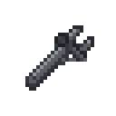
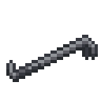

[ARGUS Station Database](../../README.md) > [Systems](../README.md) > [Engineering](README.md) > Construction

# Construction

Station construction covers the assembly and deconstruction of walls, floor sections, airlocks, windows, and machinery. All construction procedures require basic hand tools; more complex fabrications require cable and electronic components. This article documents standard construction procedures for each structure type.

---

## Construction Tools

The following tools are used across all construction procedures. Each tool has a defined interaction time; higher-quality tools reduce the time taken.

| Icon | Tool | Primary Use |
|---|---|---|
|  | Wrench | Anchoring structures to the floor; dismantling unanchored frames |
|  | Screwdriver | Fastening components; completing assemblies |
|  | Welder | Cutting and welding; repairing damage; deconstructing anchored structures |
|  | Crowbar | Prying components free; reversing construction steps |
|  | Wirecutters | Removing cable; reversing wired stages |

---

## Machine Assembly

Machines are built using steel frames. All machinery follows the same five-stage process, with minor variations for computers and wall displays.

### Stage 1: Place Frame

A machine frame is placed on the floor. At this stage the frame is unanchored and can be moved. The frame accepts a circuit board appropriate to the machine being built.

- Wrench: Anchor the frame to the floor (prevents removal) or reverse if already anchored.
- Welder (unanchored): Deconstruct the frame, recovering steel sheets.

### Stage 2: Insert Circuit Board

Insert the correct circuit board into the unanchored frame. The board determines what machine will be built and what components are required.

- Screwdriver: Fasten the board in place, advancing to Stage 3.
- Crowbar: Remove the board and revert to Stage 1.

### Stage 3: Install Cable

Feed cable from a cable coil into the wired frame. Five lengths of cable are required.

- Add cable coil (5 lengths): Advance to Stage 4.
- Wirecutters: Remove cable, reverting to Stage 2.

### Stage 4: Install Components

Add the machine components specified by the circuit board. Required components vary by machine type. Most standard machinery requires a combination of stock parts (matter bins, micro-manipulators, capacitors, scanning modules, laser assemblies).

For computers and display terminals, two sheets of glass are added at this stage instead of stock parts, advancing to Stage 5 (Panelled).

- Add required components: Prepares for final assembly.
- Crowbar: Recover components; revert toward Stage 3.
- Wirecutters: Remove cable; revert to Stage 2.

### Stage 5: Complete Assembly

Once all components are installed, a final fastening pass completes the machine.

- Screwdriver: Build the machine. The frame is replaced by the completed device.
- Crowbar (computers/displays): Remove the glass panel, reverting to Stage 4.

---

## Wall Construction

### Building a Wall

**Step 1: Place and secure the girder**

Place a girder on the target section. Use a wrench to anchor it to the floor.

**Step 2 (optional): Reinforce the girder**

Use a screwdriver to toggle reinforcing mode on the girder, then apply one sheet of any structural material to add a reinforcing layer. Reinforced girders produce reinforced walls.

**Step 3: Apply wall material**

Apply material sheets to the anchored girder to build the wall surface. A standard wall requires two sheets; a reinforced wall requires one sheet applied over the reinforced girder.

The material used determines the wall type. Steel produces standard plating; other materials (wood, plasteel, stone, etc.) produce variants with different durability and appearance.

### Deconstructing a Wall

Standard wall deconstruction requires a welder. The time required scales with the wall's maximum health; more durable wall materials take longer to cut through.

Alternatively, an anchored girder exposed after partial deconstruction can be dismantled with a wrench, taking additional time proportional to wall strength.

A plasma cutter completes this in approximately 3 seconds regardless of material.

---

## Floor Installation

Floor sections are placed as prefabricated frames from a stack of material sheets. Activating a frame sheet in hand opens a selection menu for the floor type. The frame is then placed on the target location and anchors automatically.

Excess material above the minimum required for the selected floor type is returned.

---

## Airlock and Door Assembly

Airlocks are assembled from a door assembly frame in five steps.

### Step 1: Secure the Frame

Place the door assembly frame. Use a wrench to anchor it to the floor. An unanchored frame can be deconstructed with a welder, recovering four steel sheets.

### Step 2: Wire the Frame

Feed cable from a cable coil into the frame. One length of cable is required.

- Add cable: Advance to Step 3.
- Wirecutters: Remove cable, reverting to Step 1.

### Step 3: Install Airlock Electronics

Insert an airlock electronics board into the wired frame. The electronics board controls access configuration and access tier.

- Add electronics board: Advance to Step 4.
- Crowbar: Remove board, reverting to Step 2.

### Step 4: Apply Optional Plating or Glazing

At this stage the frame can optionally receive glass or a decorative mineral plating.

- Add one sheet of reinforced glass: Install a windowed airlock (viewport only).
- Add two sheets of a luxury material (gold, silver, diamond, uranium, phoron, or sandstone): Install a decorative mineral facing.
- Welder: Remove installed glass or plating.

This step is optional; the assembly can proceed directly to completion.

### Step 5: Complete the Airlock

- Screwdriver: Seal the frame, completing construction. The assembly is replaced by a functional airlock.

---

## Window and Windoor Construction

### Standard Window

Windows are placed as individual transparent panels occupying a single frame section. A placed window starts unanchored.

- Screwdriver: Anchor the window to the floor section.
- Wrench (unanchored): Dismantle the window, recovering the glass sheet.

Anchored windows can be reinforced by applying rods, then pried into the wall frame with a crowbar.

**Reinforced Windows**

Reinforced windows are produced by applying a set of rods to an anchored standard window, then using a crowbar to seat the rod-frame assembly. Reinforced windows take half damage from impacts and have significantly higher maximum health.

Adding cable to a reinforced window installs electrochromic wiring, enabling opacity polarisation.

### Repairing Windows

A damaged window (health below maximum) can be repaired with a welder. This restores health without requiring deconstruction.

### Full-Section Windows (Large Panels)

Large window panels follow the same anchoring and reinforcement process but require four sheets of material to deconstruct rather than one.

---

## Structural Notes

### Tool Speed

All construction times listed assume standard-quality tools. Higher-quality versions of each tool type reduce interaction time via a speed multiplier. Most fabricated tools from the autolathe or exosuit fabricator operate faster than the basic equivalents from the equipment vendor.

### Material Variants

Most construction procedures accept alternative materials in place of standard steel or glass. The material used determines the final structure's appearance and may affect its durability rating. Plasteel walls have greater structural integrity than standard steel; stone and wood walls are less durable. Borosilicate glass panels are more impact-resistant than standard reinforced glass.

### Deconstruction vs. Salvage

Fully assembled machines can be deconstructed in reverse order of assembly by applying the appropriate tools at each stage. Circuit boards, stock parts, and cable are generally recoverable. However, machines that have sustained fire or explosion damage may return fewer components.
