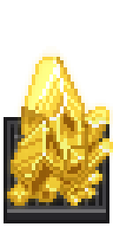
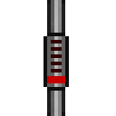
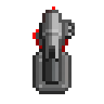
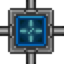
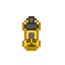
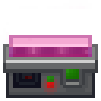

[ARGUS Station Database](../../README.md) > [Systems](../README.md) > [Engineering](README.md) > Supermatter Engine

# Supermatter Engine

The station's primary power source: a supermatter crystal energized by an emitter and kept stable by a circulating [phoron](../../History/PhoronAndBluespace.md) coolant loop.

---

## Quick Reference

### Systems

| Component | Purpose | Notable |
|---|---|---|
| [The Crystal](#the-crystal) | Primary power source | Delamination at 0% integrity |
| [Crystal Handling](#crystal-handling) | Moving or installing the crystal | Pull only; no diagonal movement; container cannot be resealed |
| [Cooling Loop](#cooling-loop) | Removes heat from the engine chamber | Canister counts vary by map |
| [Emitter](#emitter) | Energizes the crystal | 3-shot bursts; discharge count depends on setup variant |
| [Gas Filtration](#gas-filtration) | Maintains coolant composition | Southern Cross: reconfigure filter to phoron before activating |
| [Waste Gas Handling](#waste-gas-handling) | Routes waste heat out of the engine | Regulator requires one-time initialization cycle |
| [Radiation Safety](#radiation-safety) | Ambient radiation from active crystal | Radiation suit, hood, and meson goggles all required |

### Procedures

| Procedure | Maps | Notes |
|---|---|---|
| [Standard Cold Startup](#setup-procedure) | All | Phoron setup; emitter fires ~20 times then deactivates |
| [Always-On Configuration](#advanced-always-on-configuration-cetus) | Cetus only | Cold loop recirculates through TEG; emitter runs continuously |
| [Monitoring](#monitoring) | All | Console readouts: integrity, temperature, EER |

### Emergency Procedures

| Procedure | Effect | Recovery |
|---|---|---|
| [Emergency Loop Equalization](#emergency-loop-equalization) | Equalizes both loops; kills all power production | Recoverable: close valves to restore power |
| [Emergency Crystal Ejection](#emergency-crystal-ejection) | Removes crystal from station interior | Last resort; doors must open before ejection |

---

## The Crystal

The **supermatter crystal** is a dense iridescent formation fixed permanently at the center of the engine chamber. It cannot be moved or removed. When active, it generates continuous electrical power for the station and emits radiation proportional to its current output level. Crew in the engine chamber without meson goggles will experience cognitive disruption from extended proximity.

Power output scales with how much energy has been put into the crystal. Too little energy and the station's power draw will exceed supply. Too much, and the cooling system may be unable to remove heat fast enough.

**Integrity** is the primary health indicator, expressed as a percentage on the monitoring console:

| Integrity | State | Behavior |
|---|---|---|
| 90 -- 100% | Normal | No alerts |
| 50 -- 89% | Warning | Engineering broadcast; amber chamber lighting |
| 1 -- 49% | Emergency | Station-wide public alert; critical alarms |
| 0% | Delamination | 30-second countdown; catastrophic explosion |

> [!CAUTION]
> **Delamination** is a total containment failure -- the crystal releases all stored energy simultaneously. The resulting explosion destroys the engine room, breaches the hull, and delivers a station-wide 40 Sv radiation burst to all pressurized areas. The 30-second window before completion is rarely sufficient to reverse the failure once integrity reaches zero.

**Delamination** is a total containment failure. The crystal releases all stored energy simultaneously, producing a massive explosion centered on the engine chamber. The blast destroys the engine room outright, breaches the surrounding hull, and propagates structural damage outward through adjacent sections. Simultaneously, a station-wide 40 Sv radiation burst reaches every pressurized area of the station regardless of distance from the engine; personnel in sealed rooms on the opposite end of the station will still receive a significant dose. A station-wide power disruption shuts down most APCs and overloads lighting across the station; solar panels on the engine level have a high probability of being damaged simultaneously. The severity of the explosion scales with the crystal's power level at the moment of delamination: an engine fired to maximum output produces a proportionally larger blast radius and yield. The 30-second window before delamination completes is sufficient to exit the engine room but is rarely sufficient to reverse the failure once integrity reaches zero.

### Crystal Handling

*Notes contributed by Engineer#1.*

> [!WARNING]
> The supermatter crystal destroys any living creature that makes direct contact with it, instantly and fatally. It cannot be pushed -- any attempt to push the crystal results in contact. Pull only, in straight lines.

The supermatter crystal will instantly and fatally destroy any living creature that makes direct contact with it. It cannot be pushed. Any attempt to push the crystal results in contact with it. It can only be pulled. The crystal rests on a small wheeled platform; pulling the platform moves the crystal safely as long as contact is avoided.

**When pulling the crystal, do not move diagonally.** Diagonal movement significantly increases the risk of drifting into the crystal. Move in straight lines only.

**Crystal from Cargo:** A supermatter crystal requisitioned through Cargo arrives in a sealed container that any engineer can open. The container cannot be resealed once opened, which means the crystal will be fully exposed at whatever location it was unpacked. Choose the unpacking location carefully.

---

**EER (Emission Energy Ratio)** measures the molar concentration of gases immediately surrounding the crystal, displayed in MeV/cm³:

| EER | Status |
|---|---|
| Below 1.0 | Normal |
| 1.0 -- 4.0 | Caution |
| Above 4.0 | Critical |

High EER indicates gas is building up faster than the cooling loop can remove it. This raises temperature and accelerates damage.

---

## Cooling Loop

The cooling system circulates gas through the engine chamber continuously, absorbing heat from the crystal and carrying it away. The system runs as two connected loops sharing a set of heat exchangers.

| Loop | Path |
|---|---|
| Hot loop | From the engine chamber, through the heat exchangers, back to the chamber |
| Cold loop | From the heat exchangers, along the exterior hull to space, back to the exchangers |

**Coolant: phoron.** Phoron has a specific heat of 200 J/mol·K, approximately ten times that of nitrogen or oxygen. This allows each mole of phoron to absorb far more thermal energy per degree of temperature rise, keeping the chamber below the 5000 K damage threshold even at sustained high output.

Phoron canisters must be wrenched to the loop connector ports to attach them to the pipe network. Do not open the canister valve: doing so releases phoron into the room atmosphere rather than into the pipes. The pumps draw gas from the canisters once they are running.

**Station-specific canister requirements:**

On **Southern Cross**, the hot loop connector is cyan and takes two phoron canisters; the cold loop connector is green and takes three. Five canisters total.

On **Cetus**, each loop connector takes two phoron canisters. Four canisters total.

**Pumps** must all be set to maximum pressure and activated. Idle or low-pressure pumps allow heat to accumulate in the chamber. Every pump in both loops should be running at full pressure before the emitter is activated.

**Heat exchangers** transfer thermal energy from the hot loop to the cold loop without mixing gases. They require no configuration; connecting them to both loops is sufficient.

---

## Emitter

The **emitter** is the high-energy projector that transfers energy into the supermatter crystal. It must be physically secured before it can be operated.

**Securing the emitter:**

1. Apply a wrench to bolt it to the floor.
2. Apply a welder to seal it in place.
3. Present an ID card with engineering access to lock the controls.

Securing is optional. The emitter fires and functions normally without being bolted or locked. Securing it prevents unauthorized personnel from moving or operating it, which is relevant when station security is a concern. In a routine startup, skipping the wrench and welder steps is common practice.

**Firing:** For a phoron coolant setup, the emitter should be fired approximately 20 times before being deactivated. The emitter fires in 3-shot bursts with a brief pause between each burst. Each discharge transfers energy into the crystal, raising its output level. Fewer shots suit nitrogen setups (~8) and CO₂ setups (~10); phoron's higher heat capacity supports the higher energy input.

Each shot produces a small spark discharge at the emitter. This is normal behavior. In the event of a prior phoron leak in the engine room, sparks present an ignition risk; confirm the area is clear of phoron accumulation before firing.

The emitter draws substantial power from the grid while active. Confirm the SMES banks are charged before firing.

---

## Gas Filtration

The supermatter crystal releases phoron as a byproduct of operation. Without filtration, this accumulates in the cooling loop, shifting the gas composition and reducing cooling efficiency over time.

**Omnifilters** separate individual gases from the loop and route them to dedicated outputs. For a phoron coolant setup, at least one omnifilter port should be configured for phoron and connected to a storage tank or waste exhaust. The filter separates the phoron byproduct from the main coolant flow and keeps the loop composition stable.

**Configuration:**

- Set one port as the loop input.
- Set one port as the loop output, returning filtered gas to the cooling loop.
- Set one or more additional ports to filter phoron, connected to an appropriate destination.

If other byproduct gases accumulate over time, add filter ports for each gas type as needed. The omnifilter supports multiple simultaneous gas streams through separate ports.

**Station-specific notes:**

On **Cetus**, the omnifilters are pre-configured correctly for phoron filtration. Activating them at startup is sufficient; no reconfiguration is needed.

On **Southern Cross**, the omnifilters default to filtering nitrogen rather than phoron. Before activating them, change the filter target on each unit to phoron. Turning them on with the nitrogen setting active will pull nitrogen from the coolant loop instead of clearing the phoron byproduct, degrading cooling performance over time.

---

## Waste Gas Handling

*Notes contributed by Engineer#2.*

Excess gas and waste heat from the engine chamber are routed to a dedicated waste gas handling room. This system requires both startup activation and a one-time initialization cycle that must not be skipped.

**Pumps:** Both pumps serving the waste gas handling room must be set to maximum pressure and activated before the engine is fired.

**Regulator initialization:** The regulator controlling the waste gas flow cannot correctly manage pressure in either direction until it has been cycled once. Skipping this leaves it unable to regulate properly.

Cycle procedure:

1. Confirm there is gas present in the pipe.
2. Set the regulator to **output** mode.
3. Allow exactly one tick of gas to flow through.
4. Set the regulator back to **input** mode.

The regulator will now function correctly for the remainder of the session.

**Waste gas cooling loop:** Take one full CO₂ canister and pump its entire contents into the waste gas cooling loop connector. CO₂ serves as the thermal medium in the waste handling loop; the loop requires it to function.

---

## Radiation Safety

The active crystal produces two distinct hazards that require separate protective measures. **Neither piece of protective equipment substitutes for the other.**

### Cognitive Hazard

The crystal induces progressive cognitive disruption in unprotected crew within approximately 7 tiles. The effect scales with the crystal's current power level and worsens with proximity. **Meson goggles** are the only protection against this hazard. Standard eyewear, tinted visors, and radiation shielding offer no protection.

### Radiation Hazard

The crystal emits continuous ionizing radiation. At minimum power the ambient dose is approximately 50 Sv/h; at sustained high output this rises substantially. Radiation exposure causes cumulative physical damage. The **radiation suit and radiation hood** together provide full-body shielding against this hazard. The suit must be worn over standard clothing; the hood must be worn on the head. Meson goggles offer no protection against radiation damage.

> [!IMPORTANT]
> Standard engine room kit: radiation suit, radiation hood, and meson goggles worn simultaneously. Neither the suit nor the goggles substitutes for the other. Meson goggles protect against cognitive disruption only. The radiation suit and hood protect against radiation damage only.

**Standard engine room kit: radiation suit, radiation hood, and meson goggles worn simultaneously.**

### Protective Equipment

| | Equipment | Protects against |
|:---:|---|---|
|  | Meson goggles | Cognitive disruption from crystal proximity |
|  | Radiation suit | Ionizing radiation damage |
|  | Radiation hood | Ionizing radiation damage (head and face) |
|  | Geiger counter | Measures ambient radiation level; no protection |

### Radiation Collectors

**Radiation collectors** placed around the crystal convert ambient radiation into supplemental electrical power. Each collector requires a phoron tank and consumes a small amount of phoron per tick while active. Power output scales directly with the quantity of phoron remaining in the tank; a full tank produces significantly more power than a nearly depleted one. Keep tanks topped up for best results.

Radiation collectors are not stocked in engineering storage on this station. They can be requisitioned through Cargo or located on the SIF.

### Delamination Burst

When the crystal delaminates, it releases a 40 Sv radiation burst that propagates through every pressurized section of the station simultaneously. No location is shielded. Crew in the engine room at the moment of delamination receive a lethal dose regardless of what protection they are wearing; the blast renders all equipment in the immediate area inoperable. Crew elsewhere on the station will receive a dose proportional to distance and shielding, but the burst is sufficient to cause acute radiation injury across most of the station. Evacuation of the engine room at the first emergency alert is the only reliable means of avoiding the worst of this exposure.

---

## Setup Procedure

*Procedure contributed by Engineer#1; waste gas steps contributed by Engineer#2.*

The following procedure covers a cold startup using phoron coolant, which is standard for maximum power output.

**Prerequisites:**

- SMES banks charged
- Radiation suit, radiation hood, and meson goggles worn
- Phoron canisters available (Southern Cross: 5 total, 2 for the hot loop and 3 for the cold loop; Cetus: 4 total, 2 per loop)
- One CO₂ canister available for the waste gas cooling loop

**Steps:**

1. Wrench the appropriate number of phoron canisters to the hot loop connector port.
2. Wrench the appropriate number of phoron canisters to the cold loop connector port.
3. Set all visible cooling loop pumps to maximum pressure. Activate each one.
4. Max and activate both pumps serving the waste gas handling room.
5. Cycle the waste gas regulator: set it to output mode, allow one tick of gas to flow through, then set it back to input mode.
6. Pump a full CO₂ canister completely into the waste gas cooling loop connector.
7. Configure the omnifilters: assign one port as input, one as output, and one or more as phoron filter outputs. Verify gas is circulating through the filter.
8. Activate the emitter and allow it to fire approximately 20 times. Deactivate it. (Optional: secure the emitter first with a wrench and welder to prevent unauthorized use.)
9. Check the SM monitoring console. Integrity should read 100%, temperature below 5000 K, EER below 1.0.

The crystal stabilizes at a moderate power level within a few minutes of the final emitter discharge. If integrity begins falling before the temperature stabilizes, verify the pumps are running at maximum pressure and that both canisters are wrenched to their connector ports.

---

### Advanced: Always-On Configuration (Cetus)

*Notes contributed by Engineer#2.*

This configuration applies to **Cetus only.** It replaces the standard "fire ~20 times, deactivate" emitter procedure with a continuously running emitter, and reconfigures the cold loop for higher throughput. The result is a more efficient and self-sustaining engine that does not require manual emitter management.

**How it works:** In the standard setup the cold loop vents to space and returns, exchanging heat passively. In this configuration the cold loop output is piped back into the TEG input, recirculating the same gas continuously through the heat exchanger rather than replacing it each pass. Faster circulation increases the rate of thermal transfer between hot and cold loops, raising TEG efficiency and power output.

**Changes from the standard procedure:**

- After completing steps 1 through 7 of the standard procedure, configure the cold loop piping so that the loop output feeds back into the TEG input connector. All pumps on this recirculation loop must be set to maximum pressure.
- Do not deactivate the emitter. Leave it running continuously.

**Monitoring:** With the emitter running indefinitely, keep a closer eye on the integrity and temperature readouts than in a standard setup. The higher energy input is sustained by the improved cooling throughput; if the pipes are not configured correctly the temperature will climb faster than in a standard run.

---

## Monitoring

The SM monitoring console in the observation room displays the crystal's current state. Key readouts:

| Readout | Safe range | Response if exceeded |
|---|---|---|
| Integrity | Above 90% | Increase cooling; verify pump pressure and coolant levels |
| Temperature | Below 5000 K | Check pump flow; confirm canisters are wrenched to connector ports |
| EER | Below 1.0 MeV/cm³ | Check for gas accumulation; verify filters are active |
| Power | 150 -- 250 | Normal operating range for phoron setup |

Warning-level alerts (integrity below 90%) require prompt attention. Emergency-level alerts (integrity below 50%) require immediate response. At integrity 0%, evacuate the engine room. The 30-second window before delamination completes is not sufficient for repairs under most circumstances.

### Practical Troubleshooting

*Checklist contributed by Engineer#1.*

When the engine is underperforming or showing alerts, the console readouts are rarely the first thing to check. The following checks resolve the majority of engine problems:

**Engine room has power.** The engine room requires power to run pumps and filtration equipment. If it has gone dark or machinery is unresponsive, restore power before investigating anything else. Keep a power cell on hand or know the nearest spare location.

**Pumps are running.** Confirm all cooling loop pumps are active and set to maximum pressure. A pump that was accidentally turned off or left at low pressure will allow heat to accumulate rapidly.

**Exterior cooling pipes are intact.** The cold loop runs along the exterior hull through space. Damaged pipes appear noticeably brighter or dimmer than normal. If the exterior pipes look wrong, someone needs to perform an EVA to repair them before cooling can be restored.

**Omnifilters are correctly configured and active.** Confirm the filter target is set to phoron (not nitrogen or another gas) and that the units are turned on.

**Emergency flush valves are untouched.** The emergency flush valves are small and positioned where they can be accidentally bumped. If one has been tripped, phoron stops reaching the crystal and the engine will lose cooling. Check that all flush valves are in their default closed position. Do not operate them unless intentionally venting the loop.

If the above checks do not stabilize integrity, proceed to [Emergency Loop Equalization](#emergency-loop-equalization) before considering ejection.

---

## Emergency Loop Equalization

*Notes contributed by Engineer#2.*

Two digital valves are installed in the engine room, identifiable by the white indicator squares marking their positions. In normal operation these valves are closed and both loops run independently.

**Opening both valves connects the hot and cold loops directly.** Gas transfers freely between them, equalizing the temperature across the combined loop. The equalization draws heat away from the supermatter crystal rapidly, producing a cooling effect considerably faster than the normal heat exchanger process.

**Tradeoff:** The TEG generates power from the temperature differential between the two loops. Equalizing them collapses that differential and drops power output to zero for as long as the valves remain open. The station will lose SM-derived power immediately on opening.

**Procedure:**

1. Open both digital valves.
2. Monitor the SM console. Temperature should begin falling.
3. Once temperature is back within safe range and integrity has stabilized, close both valves.
4. Power production will resume as the temperature differential re-establishes between the loops.

This is an intermediate emergency measure, more drastic than pump and filter adjustments but recoverable. If equalization does not bring the crystal back under control, proceed to [Emergency Crystal Ejection](#emergency-crystal-ejection).

---

## Emergency Crystal Ejection

*Procedure contributed by Engineer#1.*

If the crystal cannot be stabilized and delamination is imminent, it can be ejected from the station via the mass driver built into the engine room floor. Ejection does not prevent delamination, but removes the blast from the station interior.

**Prerequisites:**

- Confirm the crystal is resting on the mass driver. If it has shifted off the driver platform, someone must enter the engine chamber wearing full radiation protection and pull the crystal back onto it before ejection can proceed. Do not skip this step: a crystal not on the driver will not eject cleanly. See [Crystal Handling](#crystal-handling) for movement rules; move in straight lines only and do not approach diagonally.

**Ejection steps:**

1. Proceed to the Chief Engineer's office.
2. Open the SM eject blast doors from the controls in the office.
3. **Wait for the doors to fully open before continuing.** If the eject button is used while the doors are closed, the crystal will impact the door, knock itself off the mass driver, and remain inside the station. Recovery then requires re-entering the engine chamber to pull the crystal back onto the driver before a second attempt is possible.
4. Once the blast doors are confirmed open, break the protective glass covering the eject button.
5. Press the eject button. The mass driver will launch the crystal out of the station.

Evacuate the engine room and surrounding areas immediately after ejection regardless of outcome. If the crystal delaminated in transit, the station-wide radiation burst will still occur.
