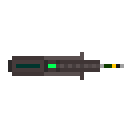
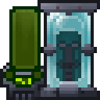
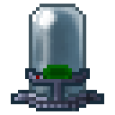
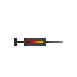

[ARGUS Station Database](../../README.md) > [Systems](../README.md) > [Medical](README.md) > Genetics

# Genetics

Station genetics operations cover DNA scanning and manipulation, gene isolation and transfer via injectors, and the cloning of deceased crew using stored body records.

---

## Quick Reference

| Item | Function | Notable |
|---|---|---|
| [GenePeeper 3000](#genepeeper-3000) | Handheld gene scanner | Reads traits, enzymes, radiation, clone loss |
| [DNA Modifier](#dna-modifier) | Scanner pod; subject enters for manipulation | Accepts beakers for reagent injection |
| [DNA Modifier Console](#dna-modifier-console) | Controls the modifier; buffer and irradiation management | 3 internal buffers; disk and sleeve support |
| [Cloning Console](#cloning-console) | Manages stored body records and initiates cloning | **Non-operational** |
| [Clone Pod](#clone-pod) | Grows clones from body records | **Non-operational** |
| [Body Record Disk](#body-record-disk) | Portable storage for a single body record | Usable in both modifier console and cloning console |
| [DNA Injector](#dna-injector) | Applies a single buffered SE block to a target | Created at the modifier console |
| [Positive Genes](#positive-genes) | Superpowers; not present at round start | Require irradiation or injectors to activate |
| [Negative Genes](#negative-genes) | Disabilities; may be present at round start | Can be suppressed by buffer transfer |
| [Neutral Genes](#neutral-genes) | Behavioral traits | Cost 0 or minor negative |
| [Side Effects](#side-effects) | Complications from genetic procedures | 3 types; each has a specific antidote |
| [Cloning Procedure](#cloning-procedure) | Full workflow from scan to revival | **Non-operational; documented for reference only** |
| [Species Compatibility](#species-compatibility) | Which species can be scanned and cloned | Lleill: scan only; many species fully incompatible |

---

## Equipment

### GenePeeper 3000

The **GenePeeper 3000** is a belt-slot handheld scanner. Applying it to a living mob, an organ, or a DNA injector begins a 6-second scan. On completion, the device produces a readout showing unique enzymes, blood type, current radiation level, clone loss, and a list of all active genes with their encoded block values and descriptions. Genes that are present but suppressed by trait conflicts are flagged as suppressed.

If the subject's genetics are flagged as unstable, the readout notes this directly. Species whose biology is incompatible with the scanning equipment are flagged as not acceptable for genetic sampling. Severe irradiation (above 200 units) and husked anatomical structure are reported separately.

---

### DNA Modifier

The **DNA Modifier** is a walk-in pod. A subject enters by moving into it; the modifier can also accept a subject via drag-and-drop by another person, or by insertion of a preserved brain organ. Subjects with abiotic items cannot enter. Borgs cannot be scanned.

A beaker may be loaded into the modifier to allow reagent injection through the console. The modifier links to an adjacent DNA Modifier Console to the north, south, east, or west.

---

### DNA Modifier Console

The **DNA Modifier Console** provides three operational tabs.

**SE tab** (Structural Enzymes): Displays the active genes of the current occupant. Shows unique enzymes, unique identity, and structural enzyme string. Allows selection of a specific SE block (1 to 93) and subblock (1 to 3) for targeted irradiation. Irradiation controls set duration (1 to 20) and intensity (1 to 10).

Two irradiation modes are available. **SE irradiation** targets the selected block directly. On success (probability of 80 plus half the duration), the block values are randomly scrambled and there is a 20% chance the result is applied to an adjacent block instead. On failure, a random bad mutation is applied and the subject receives radiation. **Full pulse** irradiates the whole body: 95% probability of a random bad mutation, 5% probability of a random good mutation. Both modes lock the modifier for the irradiation duration and apply radiation damage scaled to intensity and duration.

**Buffer tab**: Three numbered buffers, each holding a body record. Buffers can be saved from the current occupant, loaded from a body record disk, cleared, or relabeled. A buffer can be transferred to the current occupant, overwriting their structural enzymes; the occupant is irradiated and all active genes are re-evaluated. A buffer can produce a DNA injector (with a 5-second cooldown per injector). The **Sleeve** option sends the buffer to a clone pod in the area to begin growing a body from the stored record.

**Rejuvenators tab**: If a beaker is loaded into the modifier, reagents can be injected directly into the current occupant in 5-unit increments up to 50 units per action.

A body record disk can be inserted into the console. Buffers can be saved to or loaded from the disk. The disk can also be ejected or wiped.

The occupant can be ejected at any time via the console. The disk is also ejected when the occupant is released.

---

### Cloning Console

> **The Cloning Console is currently non-operational.** The hardware is present but the system does not function. Cloning via this console is not available.

The **Cloning Console** is designed to manage stored body records and initiate cloning cycles. It links to an adjacent DNA Modifier at startup and to all clone pods in the same area.

The console stores body records created from successful scans. Each record holds the subject's unique enzymes, unique identity, structural enzymes, and a reference to a health implant installed in the subject at scan time. When a scan is initiated, the console verifies that the subject is alive, has a brain, is responsive, does not carry a genetic instability marker that prevents scanning, and has not already been scanned this session. Species whose biology is incompatible with the scanning equipment return an error message.

The console can operate in **standard scan mode** or **brain scan mode**. Brain scan mode requires a scanner with scan level 4 or higher (tier 4 scanning module) and produces a higher-fidelity record. Autoprocess mode (scan level 3 or higher) automatically scans occupants and starts cloning without manual intervention.

When a deceased crew member's body is placed in the scanner, their consciousness is notified and prompted to return if it remains present nearby.

Records can be deleted from the console using a head-of-staff ID card to confirm the action.

A body record disk can be inserted to load a record from disk or save the active record to disk for transport.

---

### Clone Pod

> **The Clone Pod is currently non-operational.**

The **Clone Pod** is designed to grow organic bodies from stored body records. It requires sufficient biomass to begin a growing cycle. Only one occupant can be grown at a time. A pod showing a mess state has malfunctioned mid-cycle and must be cleared before use.

The pod heals its occupant at a fixed rate during the growing cycle. The console displays biomass level, current status (idle, cloning, or malfunction), and growing progress. Multiple pods in the same area are numbered automatically when linked to the console.

---

### Body Record Disk

The **Body Record Disk** carries a single complete body record: structural enzymes, unique identity, gender, and genetic modifiers. It is accepted by both the DNA Modifier Console and the Cloning Console. The disk is used to transfer records between systems, store a backup before major manipulation, or load a pre-prepared gene template.

---

### DNA Injector

A **DNA Injector** carries a single SE buffer or a specific SE block from a buffer. Applying the injector to a subject rewrites the corresponding portion of their structural enzymes and triggers a mutation check. Some injectors carry a radiation risk that causes additional radiation damage on injection. Each injector is labeled with its buffer name; block injectors include the block identifier in their name.

---

## DNA Structure

Every organic crew member carries a DNA record with three components.

**Unique Identity (UI)**: 65 values encoding visible physical traits: hair color, beard color, skin tone, skin color, eye color, gender, player scale, tail color and style, ear style and color, ear secondary colors, wing style and color, and gradient style and color. The UI defines appearance and is edited through the body design terminal, not the DNA Modifier Console.

**Structural Enzymes (SE)**: 93 slots, each 3 values wide (block size 3). These slots encode active gene traits. Each gene occupies one block. Whether a gene is active depends on whether the block values fall within the gene's activity bounds. Irradiation changes block values, potentially activating or deactivating genes.

**Unique Enzymes (UE)**: A short alphanumeric string unique to each individual. Used as a genetic fingerprint for identification and forensic purposes. Not modifiable through the DNA Modifier.

Activity bounds determine how narrow the window for gene activation is. Three tiers are in use:

| Tier | Activation Threshold | Notes |
|---|---|---|
| Default | 802 and above | Standard window; used by beneficial and negative trait genes |
| Hard | BEA and above | Narrower window; most superpowers and selected negative genes |
| Harder | DAC and above | Tightest window; most difficult to activate and maintain |

Threshold values are the SE block values (hex-encoded) at which a gene becomes active. Lower thresholds are easier to reach through irradiation.

---

## Positive Genes

Positive gene traits are superpowers. All are hidden by default and cannot be selected at character creation. They must be activated through targeted irradiation or DNA injectors.

| Gene | Bounds | Effect |
|---|---|---|
| No Breathing | Harder | Subject does not need to breathe |
| Remote Viewing | Hard | Subject can observe remote locations |
| Regenerate | Hard | Subject slowly repairs wounds and internal bleeding |
| Telepathy | Hard | Subject can communicate remotely |
| No Prints | Default | Subject leaves no fingerprints |
| X-Ray Vision | Hard | Subject can see through walls |
| Telekinesis | Harder | Subject can move objects without physical contact |
| Laser Vision | Harder | Subject fires lasers from eyes on harm intent |
| Hulk | Harder | Subject gains enhanced strength; auto-deactivates below 25 health |
| Flash Resistance | Hard | Subject's eyes are protected against intense flash blindness |
| Morph | Hard | Subject gains access to a body transformation interface |

Hulk deactivation is automatic when the subject's health drops below 25: the genetic activation is suppressed and the subject is briefly weakened.

---

## Negative Genes

Negative gene traits are disabilities. Some may be present in a subject's baseline DNA.

| Gene | Effect | Notes |
|---|---|---|
| Epilepsy | Periodic seizures | |
| Coughing Fits | Uncontrollable coughing | |
| Clumsy | 15% chance to fumble; 10% chance to harm self with tools | |
| Coprolalia | Periodic involuntary profanity outbursts | |
| Mute | Cannot speak | Mutually exclusive with Incomprehensible |
| Deaf | Cannot hear | |
| Nearsighted | Reduced vision range | |
| Incomprehensible | Speech is unintelligible gibberish | Mutually exclusive with Mute |
| Rotting Genetics | Random limb and organ deterioration over time | Mutually exclusive with Stable Genetics trait |
| Gibbingtons | Body may explode from trauma | Not visible on gene scan |
| Lumbar Impairment | Legs nonfunctional; subject cannot stand | Hard bounds |
| Censored | Cannot use profanity | |
| Nervousness | Periodic stuttering | |

---

## Neutral Genes

| Gene | Effect | Notes |
|---|---|---|
| Tourettes Syndrome | Motor and vocal tics; worsens under stress | Cost 0 |

---

## Side Effects

Genetic procedures can trigger side effects. When a side effect fires, a random type is selected from the three available. The subject is briefly weakened 2 seconds after onset. If the appropriate antidote reagent is present in the subject's bloodstream, ingested, or applied topically at the time the effect resolves, the harmful outcome is prevented.

| Side Effect | Duration | Antidote | Untreated Result |
|---|---|---|---|
| Genetic Burn | 30 seconds | Dexalin | All external organs take 5 brute damage |
| Bone Snap | 60 seconds | Bicaridine | Random limb: 20 brute damage and fracture |
| Genetic Confusion | 30 seconds | Antitoxin | Subject is confused for 100 ticks |

Onset is visible: Genetic Burn causes visible reddening, Bone Snap causes uncontrollable shivering of the limbs, and Genetic Confusion causes drooling. These cues are distinct and allow identification of the active side effect type before it resolves.

---

## Cloning Procedure

> **The cloning system is currently non-operational.** The equipment is installed and documented below for reference, but cloning does not function at this time.

Cloning is designed to restore a deceased crew member to a functional body grown from their stored genetic record.

**Requirements for scanning:**
- Subject must be a species compatible with genetic scanning equipment
- Subject must have a brain present
- Subject must be responsive
- Subject must not carry a genetic instability marker that prevents scanning
- Subject must not have committed suicide
- Subject must not already have a record stored this session

**Standard procedure:**

1. Place the subject in the DNA Modifier adjacent to the Cloning Console.
2. At the Cloning Console, initiate a scan. The console stores the resulting body record and installs a health implant in the subject to track vitals remotely.
3. Confirm biomass is available in the selected clone pod.
4. Select the record from the Records menu and choose Clone. The console removes the record from storage and starts the growing cycle.
5. The clone pod grows the body over time. The subject's consciousness can re-enter the body on completion.

If brain scan mode is available (scanner tier 4), enable it before scanning for a higher-fidelity record.

Autoprocess mode (scanner tier 3 or higher) scans occupants and starts cloning automatically without manual intervention at each step.

Records can be saved to a body record disk for later revival or transfer to another station's cloning system. Records can be loaded back from disk through the console's disk management options.

---

## Species Compatibility

Not all species possess standard organic DNA. Species whose biological composition is incompatible with the scanning equipment will return an error when placed in the modifier or scanned at the cloning console. Some species carry readable genetic material but lack the biological substrate required to grow a clone body.

| Species | Scan | Clone | Notes |
|---|:---:|:---:|---|
| Human | Yes | Yes | |
| Unathi | Yes | Yes | |
| Tajaran | Yes | Yes | |
| Skrell | Yes | Yes | |
| Zaddat | Yes | Yes | |
| Sergal | Yes | Yes | |
| Akula | Yes | Yes | |
| Nevrean | Yes | Yes | |
| Hi-Zoxxen / Zorren | Yes | Yes | |
| Vulpkanin | Yes | Yes | |
| Harpy | Yes | Yes | |
| Lleill | Yes | No | Carries readable genetic material; biology does not support cloning |
| Skeleton | No | No | Biological composition incompatible with scanning equipment |
| Vox | No | No | Biological composition incompatible with scanning equipment |
| Golem | No | No | Synthetic/mineral composition; incompatible |
| Promethean | No | No | Fluid biological composition; incompatible |
| Protean | No | No | Fluid biological composition; incompatible |
| Alraune | No | No | Plant-based biology; incompatible |
| Shadekin | No | No | Biological composition incompatible; applies to both base and crew variants |
| Diona | No | No | Plant-based biology; incompatible |
| Xenochimera | No | No | Biological composition incompatible with scanning equipment |
| Shadow | No | No | Non-corporeal composition; incompatible |
| Xenomorph | No | No | Biological composition incompatible with scanning equipment |
| Synthetic | No | No | Synthetic biology is incompatible with organic DNA scanning equipment |
| X Occursus / X Anomalous / X Unowas | Varies | Varies | Aberrant entities; equipment response has been inconsistent across observed specimens |

Species not listed here are presumed to follow standard organic DNA behavior.

---

*All records authored and maintained by ARGUS. Corrections contributed by Geneticist#1.*
