[ARGUS Station Database](../../README.md) > [Systems](../README.md) > [Medical](README.md) > Surgery

# Surgery

Medical procedures for treating internal injuries, repairing damaged tissue, managing organs and limbs, and servicing both organic and synthetic patients.

---

## Quick Reference

| Procedure | Purpose | Notable |
|---|---|---|
| [Standard Procedure](#standard-procedure) | Incision, retraction, and closure | Required for all internal surgeries |
| [Bone Repair](#bone-repair) | Mend fractured bones | Bone gel and bone setter; or bone clamp |
| [Organ Surgery](#organ-surgery) | Remove, replace, or treat internal organs | Torso and groin access only |
| [Limb Surgery](#limb-surgery) | Reattach or replace severed limbs | Organic or robotic limb required |
| [Cavity Surgery](#cavity-surgery) | Create internal storage space | Head, torso, and groin only |
| [Facial Reconstruction](#facial-reconstruction) | Repair disfigurement and vocal cord damage | Separate incision sequence |
| [Spinal Repair](#spinal-repair) | Treat spinal injury and brainstem damage | Six steps; extended duration |
| [Necrotic Treatment](#necrotic-treatment) | Address dead or infected tissue | Peridaxon or bioregen required |
| [Robotic Repair](#robotic-repair) | Service mechanical limbs and organs | Hatch access replaces incision |
| [External Treatment](#external-treatment) | Treat surface burns and brute damage | No incision required |
| [Hardsuit Removal](#hardsuit-removal) | Free a stuck hardsuit or RIG | Plasma cutter or welder |
| [NIF Implantation (Standard)](#nif-implantation-standard) | Install NIF in cranial cavity | Head cavity surgery; organic species only |
| [NIF Implantation (Promethean)](#nif-implantation-promethean) | Install bioadaptive NIF in Promethean patient | No surgical tools; bioadaptive variant required |

---

## Tools

Surgical tools are stocked in the medical locker and surgical preparation area. Each procedure lists its primary tool and alternatives that may substitute under field conditions. Primary tools are recommended; alternatives are less reliable.

| | | | |
|:---:|---|:---:|---|
| 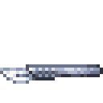 | **Scalpel** -- Creating incisions; detaching organs | 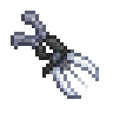 | **Hemostat** -- Clamping bleeders; extracting tissue |
| 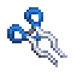 | **Retractor** -- Retracting flesh to expose the interior |  | **Cautery** -- Sealing incisions |
| 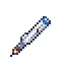 | **Circular saw** -- Amputation; bone cutting | 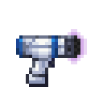 | **Bone gel** -- Bonding and finishing fracture repairs |
| 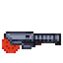 | **Bone setter** -- Setting displaced bones | 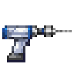 | **Surgical drill** -- Creating cavities; vertebral drilling |
| 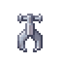 | **Bone clamp** -- Single-step fracture repair | 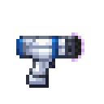 | **FixOVein** -- Repairing blood vessels and internal bleeding |
| 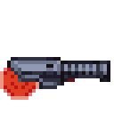 | **Bioregen** -- Restoring tissue; detoxification | 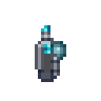 | **Nanopaste** -- Repairing robotic organs and components |

### Scalpel Variants

| | Scalpel | | Scalpel |
|:---:|---|:---:|---|
|  | Standard |  | Laser (tier 1) |
| 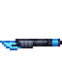 | Laser (tier 2) |  | Laser (tier 3) |
| 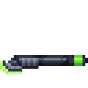 | Incision manager | | |

Laser scalpels produce bloodless incisions and may reduce subsequent bleeding. The incision manager performs the incision and retraction in a single step.

---

## Standard Procedure

All internal surgeries require an opening sequence before internal work can begin, and a closing step when the procedure is complete.

**Opening:**

1. Create an incision with a scalpel.
2. Clamp bleeders with a hemostat. This step is required when the incision produces active bleeding.
3. Retract flesh with a retractor to expose the interior.

**Closing:**

Apply cautery to seal the incision. This closes the wound and sterilizes the site.

---

## Bone Repair

Fractured bones require the flesh over the affected area to be retracted before treatment. Both repair paths begin with the standard opening sequence.

**Three-step repair:**

1. Apply bone gel to prepare the fracture site.
2. Use a bone setter to set the bone into position. On the head, bone setter work mends the skull directly; care is required at this step to avoid disfigurement.
3. Apply bone gel again to complete the repair.

**Single-step repair:**

A bone clamp applied to the site performs the full repair without the intermediate stages.

---

## Organ Surgery

Internal organ work requires a full opening sequence on the torso or groin. Organ surgery is not available on limbs or the head.

**Removing an organ:**

1. Use a scalpel to detach the target organ. The surgeon selects which organ to address.
2. Use a hemostat to extract the detached organ. It is deposited at the operating site.

**Installing an organ:**

With flesh retracted, place the replacement organ against the open cavity. It seats into the available position. Species compatibility should be confirmed before installation.

**Reattaching a detached organ:**

If an organ has been detached but not yet removed, use a FixOVein tool to reattach it in place.

**Treating a damaged organ:**

Apply an advanced bruise pack to the organ with flesh retracted. This repairs internal organ damage and addresses brain injury. Standard bruise packs are less effective.

**Repairing a robotic organ:**

Apply nanopaste to the damaged mechanical organ with flesh retracted. Cable coil or a wrench may substitute when nanopaste is unavailable.

**Detoxification:**

Bioregen applied to the torso with flesh retracted reduces accumulated toxin, oxygen, and cellular damage by a fixed amount per application.

**Repairing internal bleeding:**

Use a FixOVein tool on the affected area with flesh retracted to close all internal bleeding wounds. Cable coil may substitute.

---

## Limb Surgery

**Reattaching a severed organic limb:**

1. Place the severed limb against the stump.
2. Use a hemostat to reconnect the internal tissue and restore the limb to full function.

**Installing a robotic limb:**

Place the robotic replacement against the missing limb position. Robotic limb installation does not require the hemostat reconnection step used for organic limbs.

**Amputation:**

A circular saw severs a limb. No prior incision is required. Confirmation is required before the procedure proceeds.

---

## Cavity Surgery

A cavity can be created inside the head, torso, or groin for internal storage. Head cavities hold small items; torso cavities hold standard-sized items; groin cavities hold compact items.

**Creating a cavity:**

Use a surgical drill on the target area with flesh retracted.

**Implanting an item:**

With the cavity open, place the item. Oversized items risk tearing internal vessels.

**Removing an implanted item:**

Use a hemostat to extract the stored item from the open cavity.

**Closing a cavity:**

Apply cautery to seal the cavity.

---

## Facial Reconstruction

Facial reconstruction uses a separate procedure sequence specific to the face and neck. It addresses disfigurement and vocal cord damage. The standard opening and closing sequence is not used.

1. Use a scalpel to open the face.
2. Use a hemostat to work the vocal cords.
3. Use a retractor to reposition the facial tissue.
4. Apply cautery to close.

Completing all three preparatory steps before cauterizing removes disfigurement. Cauterizing at an earlier stage closes the wound without restoring appearance.

---

## Spinal Repair

Spinal repair addresses spinal injury and brainstem damage. The standard opening sequence on the neck is required before beginning. The procedure runs six steps in strict order.

1. **Mend vessels** -- FixOVein.
2. **Drill vertebrae** -- Surgical drill. This is the longest step; precision is required throughout.
3. **Remove bone chips** -- Hemostat.
4. **Mend spinal cord** -- FixOVein.
5. **Mend vertebrae** -- Bone gel. Completing this step re-enables cardiac resuscitation on the patient.
6. **Realign tissue** -- Hemostat. This final step heals brain damage and resolves brain death.

---

## Necrotic Treatment

Necrotic tissue must be treated before the affected organ deteriorates further. Flesh must be retracted over the affected area.

**Step 1 -- Remove dead tissue:**

Use a scalpel to debride the necrotic area.

**Step 2 -- Treat the site:**

*Chemical treatment:* Apply a peridaxon-bearing reagent to the site. This resolves the infection and restores the organ in one additional step.

*Bioregen treatment:* Apply bioregen, then use a hemostat to rearrange the tissue, then apply bioregen a second time. This three-step path is used when peridaxon is unavailable.

---

## Robotic Repair

Robotic and mechanical limbs use a hatch access sequence in place of the standard incision.

**Opening:**

1. Use a screwdriver to unseal the outer hatch.
2. Use a retractor or crowbar to open the augment port fully.

**Closing:**

Use a retractor or crowbar to close the hatch, then apply a second pass to secure it.

**Structural repair:**

Use a welder to repair physical damage to the mechanical frame. Weld fuel is required.

**Electrical repair:**

Apply cable coil to repair electrical damage. Approximately 5 lengths of cable are consumed per treatment.

**Robotic organ repair:**

Use nanopaste on the damaged organ with the hatch open. Bone gel or a screwdriver may substitute at reduced effectiveness.

**Robotic organ removal:**

Use a multitool to detach a robotic organ from its mount.

**Robotic organ installation:**

Use a screwdriver to secure a replacement robotic organ in the open cavity.

**MMI installation:**

With the hatch open on a robotic skull containing no brain, an MMI device seats directly into the mount.

---

## External Treatment

Surface injuries can be assessed and treated without opening a surgical site.

**Assessment:**

An autopsy scanner or medical analyzer assesses damage levels across the body without risk to the patient.

**Burn treatment:**

Apply advanced ointment or standard ointment directly to the burned area.

**Brute treatment:**

Apply an advanced bruise pack or standard bruise pack directly to the injured area.

---

## Hardsuit Removal

A hardsuit or RIG suit that cannot be removed through normal means can be freed surgically. No incision is required.

Apply a plasma cutter to the torso. A welder may substitute; weld fuel is required. This disables the suit's retention mechanism and allows normal removal.

---

## NIF Implantation (Standard)

Standard NIF implantation seats the device in the cranial cavity. General anaesthesia is recommended. Compatible with all organic species carrying viable genetic material; [Promethean](../../Species/Promethean.md) patients require the separate procedure below.

**Required tools:** Scalpel, hemostat, retractor, surgical drill, cautery.

1. Position the patient on the operating table. Administer anaesthesia.
2. **Scalpel** the head: create an incision.
3. **Hemostat** the head: clamp bleeders. Skip if no bleeding is present.
4. **Retractor** the head: open and clear access to the cranial cavity.
5. **Surgical drill** the head: create a cavity for the implant.
6. Hold the NIF and apply it to the patient's head: seat the implant in the cavity.
7. **Cautery** the head: close and seal the incision.

The NIF is now active. Confirm integration with the patient before discharge.

---

## NIF Implantation (Promethean)

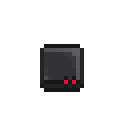

[Promethean](../../Species/Promethean.md) physiology is incompatible with standard NIF hardware. Only bioadaptive variants can interface with Promethean biology. No surgical tools or operating table are required.

**Compatible hardware:** Bioadaptive NIF, Bioadaptive Authentic NIF. Any other NIF type will be silently rejected without initiating an integration channel.

1. Confirm the NIF is a bioadaptive variant.
2. Confirm the patient's torso is structurally intact.
3. Confirm the patient has removed all worn clothing and suits. The procedure is blocked if any garment is present.
4. A second crew member (not the patient) holds the NIF and applies it directly to the patient's torso.
5. A 20-second integration channel initiates.
6. On completion the NIF is fully seated within the torso.

If the channel is interrupted, restart from step 4.

For NIF hardware specifications and variant details see [Nanite Implant Framework](../Science/NIF.md).
