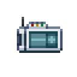

[ARGUS Station Database](../../README.md) > [Systems](../README.md) > [Medical](README.md) > Triage and Patient Assessment

# Triage and Patient Assessment

This document covers rapid patient assessment using medical equipment, triage priority under multi-casualty conditions, and species-specific treatment deviations. For damage type treatments see [Injuries](Injuries.md). For surgical procedures see [Surgery](Surgery.md).

---

## Diagnostic Equipment

### Health Bar

Medical HUDs and AR-M glasses display a floating health bar above crew members. The bar color gives an immediate triage priority estimate.

| Color | Approximate health | Priority |
|---|---|---|
| No bar | 100% | No treatment needed |
| Green | 78-99% | Low |
| Yellow | 42-71% | Moderate |
| Red | 1-21% | High |
| Red, flashing | 0 to -40% | Critical |
| Critical | -40 to -85% | Emergency |
| Dead | -100% or below | Assess for defib |

### Health Analyzer

The health analyzer provides exact brute, burn, toxin, and suffocation (oxy) values, and flags genetic damage, radiation, fractures, and internal bleeding when present. It does not quantify genetic damage, radiation, or brain damage; a body scanner is required for precise readings on these.

### Body Scanner

The body scanner produces a full diagnostic printout: all damage types with exact values, blood volume, reagent content, limb-by-limb analysis, fracture locations, internal bleeding sites, implant presence, and foreign body detection. Printouts can be handed to attending physicians for reference during surgery or treatment.

---

## Triage Protocol

The goal of triage is to stabilize patients, not fully restore health. When multiple patients are present, treat in this order:

1. Patients actively bleeding, including internal bleeding. Untreated bleeding worsens rapidly.
2. Patients with severe internal organ damage. Organ failure accelerates deterioration.
3. Critical and flashing-red patients.
4. Red patients.
5. All patients brought to at least yellow before resolving remaining damage.

For recently deceased patients: attempt defibrillation immediately. If the patient does not resuscitate, set them aside and return after stabilizing others. Patients at very high damage values may require damage reduction before defibrillation succeeds; advanced trauma kits heal 3 brute even on dead patients.

When patient volume exceeds capacity, cryogenics provides reliable stabilization. A properly set up cryo tube halts deterioration and heals most surface damage over time.

---

## Species Treatment Notes

The following species have medical properties that deviate significantly from the baseline. For full species details see the individual species articles.

| Species | Notable medical properties |
|---|---|
| [Vox](../../Species/Vox.md) | Breathes phoron; Dexalin is lethal. Liquid phoron treats oxy damage. Non-standard organ set: prosthetic brain, air capillaries, waste tract, filtration bladder, Vox heart. Cannot be resleeved. |
| [Promethean](../../Species/Promethean.md) | Burn vulnerability 2x, brute resistance 0.75x. No blood. Regenerates damage passively; water inhibits regeneration. No internal organs except slime core (chest; healed by Alkysine). Can regenerate lost limbs. Cannot suffocate. On death, melts; revive by injecting slime core with 40u phoron. Bio-adaptive NIF only. Cannot be resleeved. |
| [Diona](../../Species/Diona.md) | No internal organs. Not affected by fractures. Cannot feel pain. Regenerates in light. Most reagents have limited effect. Plant-B-Gone is severely toxic. Cannot be resleeved. |
| [Unathi](../../Species/Unathi.md) | Brute and burn resistance 0.85x. Total health 125, blood volume 840. Ribplates on torso and lower body require incision before surgery in those regions. No kidneys or appendix. Less susceptible to fractures. Bleeds 25% slower. |
| [Tajaran](../../Species/Tajaran.md) | Brute and burn vulnerability 1.15x. |
| [Teshari](../../Species/Teshari.md) | Brute and burn vulnerability 1.35x. Total health 50, blood volume 400. |
| [Xenochimera](../../Species/Xenochimera.md) | Brute resistance 0.8x, burn vulnerability 1.15x. Can self-repair at the cost of nutriment. Can self-revive if liquid nutriment is present in bloodstream. Damage, pain, and low nutrition trigger feral state. Cannot be resleeved. |
| [Vasilissans](../../Species/Vasilissans.md) | Brute resistance 0.8x, burn vulnerability 1.15x. |

---

*See also: [Injuries](Injuries.md), [Resleeving](Resleeving.md), [Surgery](Surgery.md), [Medical Sleeper Pod](Sleepers.md)*
