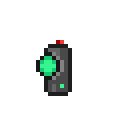
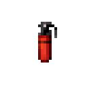

[ARGUS Station Database](../../README.md) > [Systems](../README.md) > [Security](README.md) > Security Operations

# Security Operations

Operational reference for NanoTrasen Security personnel. Covers departmental hierarchy, standard procedures, evidence handling, arrest and criminal processing, prisoner rights, and facility layout.

---

## Quick Reference

| | |
|---|---|
| [Hierarchy](#hierarchy) | HoS, Warden, Officer authority structure |
| [Responding to Calls](#responding-to-calls) | First responder protocol, scene assessment |
| [Evidence](#evidence) | Collection, handling, and chain of custody |
| [Arrest Procedure](#arrest-procedure) | Engagement, handcuffing, escort to brig |
| [Criminal Processing](#criminal-processing) | Step-by-step processing, sentencing, release |
| [Permanent Holding](#permanent-holding) | Long-term detention procedure |
| [Prisoner Rights](#prisoner-rights) | Entitlements during incarceration |
| [Standard Equipment](#standard-equipment) | Gear by rank under Code Green |
| [Secure Areas](#secure-areas) | Rules of engagement by location |
| [Executions](#executions) | Conditions and procedure |

---

## Hierarchy

The Head of Security holds authority over the entire Security department.

The Warden holds authority over the Brig and Armory. The Warden may authorize equipment and direct officers within the Brig unless overridden by the Head of Security. The Warden is responsible for the treatment and wellbeing of prisoners, including injury or death caused by other officers during a prisoner's time in the Brig.

When officers are on patrol, the Head of Security is in command. When officers are within Security, the Warden also has authority.

The Warden does not replace the Head of Security in the HoS's absence. If no Head of Security is present, the Colony Director assumes those responsibilities.

> [!IMPORTANT]
> There is no "Acting HoS" designation. Either the position is filled or it is not. The Warden does not inherit the HoS role under any circumstance.

The Colony Director does not have authority to issue orders directly to Security in the presence of an active Head of Security; orders flow through the HoS by default.

Security has no authority over civilian crew beyond [Corporate Regulations](CorporateRegulations.md). [Standard Operating Procedure](../Command/StandardOperatingProcedure.md) cannot be enforced on crew by Security; that responsibility belongs to heads of staff and Internal Affairs.

---

## Responding to Calls

When a call for Security is received, an officer responds as quickly as possible. A second officer monitoring cameras to assess the area in advance is recommended. Additional officers are dispatched based on threat level.

**If the scene is clear on arrival**: Radio in the situation. Ensure the safety of crew in the vicinity. Identify witnesses. Secure the scene if an offense has occurred. Proceed to evidence collection.

**If the scene is not clear**: Identify the nature of the threat. If the threat can be handled by present officers, proceed to mediation or detainment. If the threat exceeds current capacity, request immediate assistance and hold position until backup arrives. Confirm personal safety before addressing the safety of others on scene.

---

## Evidence

Crime scenes are sealed off before evidence collection begins. Non-Security personnel are not permitted to enter. Avoid cordoning high-traffic areas unless the offense is serious (murder, mutiny); permission from the relevant head of staff, Head of Security, or Colony Director is required to close high-traffic departmental areas.

Cordoned areas should permit access around the perimeter wherever possible. Autopsies are secondary to cloning of non-criminal bodies; autopsies are conducted in the morgue after cloning attempts. Station operations are disrupted as little as possible.

Investigative staff (Detective) should be requested. Officers on scene ensure scene security until investigative staff arrive or, if none are available, secure evidence themselves.

**Handling**: Gloves are worn at all times to prevent contamination. Items are placed in evidence bags for transport. The scene is preserved until all evidence is collected. After collection, bodies may be moved to the morgue and the area cleaned.

Suit sensor tracking and medical records require a warrant under Code Green. Under Code Blue, Security may access these records directly unless the CMO objects. Under Code Red and above, Security may freely access medical records and suit sensors.

---

## Arrest Procedure

Force escalation follows the threat level: improvised and basic melee weapons are met with shoot-to-stun; non-lethal weaponry is met with negotiation first, lethal force authorized if brandished or used; lethal weapons authorize lethal force if brandished or fired.

When arresting a suspect for any level 1 offense, an opportunity to pay a fine is offered first. If paid, no arrest proceeds.

For offenses above level 1, backup is requested for anything beyond a minor crime before engagement. One officer is sufficient for minor situations.

Upon contact with the suspect, surrender is requested. If the suspect complies, they are escorted to the Brig; handcuffs are not required for minor offenses. If the suspect refuses handcuffing but is otherwise cooperative, they are escorted by no fewer than two armed officers. If the suspect flees or resists physically, force sufficient to neutralize and detain is applied; a resisting arrest charge under [Corporate Regulations](CorporateRegulations.md) §202 is added.

Verbal disagreement or profanity does not constitute resisting arrest. Actual threats are covered under separate regulations.

Upon or after arrest, the suspect is informed of their right to pay a fine (if applicable) and their right to an Internal Affairs Agent or Lawyer for appeal.

---

## Criminal Processing

Criminal processing should not exceed a few minutes. Extended questioning before processing is not standard.

Steps upon bringing a suspect to the Brig:

1. State the reason for arrest.
2. Bring the suspect to Security Processing. If a fine may replace jail time, offer payment now. If paid, proceed to release.
3. Read out each applicable charge from [Corporate Regulations](CorporateRegulations.md) and update the security record accordingly.
4. Inform the suspect of their right to appeal through an Internal Affairs Agent. Provide the standard notification: *"According to NanoTrasen Criminal Processing Policy, you are entitled to appeal your case to an Internal Affairs Agent at this time, if such is available. Should you accept this offer, be advised your criminal processing may be delayed until your agent is satisfied with the case. If they rule in favor, they will contact the Head of Security on your behalf."*
5. Search the suspect for contraband: empty pockets, remove webbing and accessories, check PDA for stolen or illegal cartridges, check headset for unauthorized encryption keys, check footwear. Anything that could compromise cell security (kitchen knives, engineer tools) is confiscated temporarily and returned after sentencing.
6. Calculate the total sentence. Do not charge more than the minimum unless it is not the suspect's first offense this shift. Multiple instances of the same offense may justify the maximum sentence for that charge but cannot be stacked as separate counts.
7. Update the prisoner's security record. Set status to "Imprisoned."
8. Return the prisoner's PDA and headset. If the original devices cannot be returned for security reasons, provide a basic headset and a temporary PDA. All prisoners are entitled to a communication device unless the privilege is abused or the device is evidence.
9. Inform the prisoner's head of staff of the arrest. Security does not have authority to demote anyone except the Head of Security demoting a Security officer.
10. Escort the prisoner to a cell with at least one assisting officer. Place belongings not required as evidence in the cell locker.
11. Buckle the prisoner to the cell bed. Sentences over 10 minutes require the prisoner to wear an orange jumpsuit and shoes.
12. Set and start the cell timer. The door closes and the locker locks automatically.
13. Enter the cell with stun baton ready and remove handcuffs. A second officer is recommended. Leaving a prisoner restrained in a cell is unlawful except in solitary confinement.
14. Monitor the prison area for the duration of the sentence.
15. On expiry, return all temporarily confiscated goods and allow the prisoner to leave. Update status to "Released" or "Patrolled."

If an IAA or HoS is requested for appeal and none are available, the prisoner still serves the sentence until an agent becomes available. If the appeal succeeds, the prisoner is released immediately and any related injunctions are dropped.

If a prisoner's sentence accumulates to more than 90 minutes in a single holding, hold pending tribunal judgment.

---

## Permanent Holding

Bring the prisoner to Security Processing as normal. Have the prisoner remove all items except no-access identification cards, PDAs, and radio headsets (with all cartridges and chips removed). Transfer the prisoner to permanent holding. The prisoner's head of staff is notified of their status. Prisoners in permanent holding are checked on regularly.

---

## Prisoner Rights

All prisoners are entitled to the following regardless of the nature of their offenses:

Swift processing: processing may not exceed one quarter of the prisoner's sentence while the prisoner is cooperating.

Medical examination and aid on request.

Access to an Internal Affairs Agent for legal defense on request.

Access to send a fax to Central Command on request.

Food and water on request.

Clothing; the standard orange prisoner jumpsuit and shoes are provided if needed.

Safe and reasonable cell conditions including functional lighting, sleeping accommodation, and access to the Brig's communal area if the sentence exceeds 20 minutes.

---

## Standard Equipment

Equipment listed below is standard under Code Green. Weapons of all types are kept holstered and concealed during Code Green; openly carried weapons make crew unnecessarily nervous and hostile.

Security Cadet and Security Conscript

Cadets are assistants pursuing a Security career and are educated by Security personnel on regulations and procedure. Conscripts are crew temporarily recruited by the HoS during emergencies.

- Holotag (minimum requirement; no other equipment without it)
- Red armband if not issued a Security uniform
- Additional equipment at HoS discretion based on circumstance
- No weapons permitted outside Code Red or worse

Security Officer

- Security uniform or red jumpsuit equivalent
- Security softcap (optional)
- Standard Security helmet (in backpack when not responding to a call)
- Standard Security armored vest
- Standard Security HUD glasses or equivalent
- R.O.B.U.S.T. PDA cartridge
- Security belt
- Security caution tape
-  Flasher
-  Pepper spray
-  Stun baton
-  Taser (a stun revolver is an acceptable substitute)
-  Flashbang
- Hailer
-  Minimum one pair of handcuffs
- Universal recorder (optional)
- Basic first aid supplies (optional)
- Emergency light source (flare or flashlight)

Each Security locker also contains one lethal firearm under the Frontier Readiness Program, which may be selected and carried without a special permit, subject to standard lethal weapon concealment policy.

Detective

In addition to standard Security Officer equipment:

- Detective attire in place of Security uniform
- Standard Security armored vest (optional)
- Forensic scanner
- Black or latex gloves
- Evidence bags
- Universal recorder
- Camera

If two Detectives are present, investigative equipment is shared between them.

Warden

- Warden attire
- Warden armored jacket (standard Security armored vest is acceptable)
-  Box of handcuffs
- Within the Security wing: authorized to carry any available weapon except semi/fully automatic rifle-caliber ballistics, explosives, and pulse rifles
- Outside the Security wing: non-lethal weapons and munitions only, carried within a backpack

Head of Security

- Head of Security attire
- Head of Security armored coat and hat (dermal patch acceptable substitute for hat)
- Within the Security wing: any weapons except explosives
- Outside the Security wing: one or more lethal weapons (energy pistol or equivalent non-explosive) that fit in a backpack; at least one lethal weapon is recommended
- At minimum one ranged non-lethal weapon (taser or stun revolver) carried at all times; weapons with togglable stun/kill modes are classified as lethal weapons

Head of Personnel

The Head of Personnel is not a Security officer. Standard equipment is limited to the energy pistol, baton, and flash supplied for personal defense. Carrying any additional weapons constitutes a violation of [Corporate Regulations](CorporateRegulations.md) §212. As Acting Colony Director, the Head of Personnel may carry a wider variety of firearms, though this is discouraged.

Colony Director

- No more than one non-explosive lethal weapon for personal defense; possession of additional weapons (excluding a standard-issue energy pistol) violates Corporate Regulations §212
- A collapsible or stun baton is also permitted (one type recommended)
- Any body armor is permitted; cumbersome armor is not recommended given that the Colony Director's priority is escape rather than extended engagement

---

## Secure Areas

The Armory is restricted to Security and the Colony Director. Unauthorized personnel are shoot-to-kill, with the exception of the Head of Personnel, who is ordered to leave and arrested if non-compliant.

The Vault is the most important area to protect. Guards are ideally posted at the adjacent Security office. Sparking sounds near the vault warrant immediate Security backup and investigation.

The AI Core is off-limits to all personnel except heads of staff under Code Blue and above; under Code Blue, at least one additional head of staff or a Security officer must accompany any head of staff entering the upload or core. Unauthorized personnel found attempting to breach the AI core are shoot-to-kill.

The Gateway provides access to hazardous or unknown environments. Unauthorized personnel discovered actively breaching this location are confirmed with superiors before engagement; if confirmed unauthorized, they are captured, searched, interrogated, then charged and sentenced.

The Research Server Room contains sensitive information. Unauthorized personnel are captured, searched, and interrogated before sentencing.

The Brig is a high-security area. Unauthorized personnel attempting to break in or HuT inmates attempting to break out are both shoot-to-kill.

The Telecommunications Satellite provides critical communications infrastructure. Unauthorized personnel who have bypassed or destroyed the laser turrets and accessed the control room are shoot-to-kill.

---

## Executions

Executions require the physical presence of the Colony Director (not an acting Colony Director). Asset Protection must be notified. Central Command is faxed prior to the execution.

The prisoner selects their method within reason. Standard options include lethal injection (performed in Medbay surgery under medical supervision), firing squad (performed on the shooting range), phoron gassing (performed in Toxins or a purpose-built room), or exile via the Bluespace Gateway with an exile implant.

The prisoner is granted a final request within reason and a final meal.

The prisoner is escorted to the execution location under heavily armed guard, bound in a straight jacket and leg cuffs. Escorting officers are armed to kill.

> [!CAUTION]
> Permanent death from an execution, overriding planetside cloning, requires explicit Central Command authorization and is extremely rare. On-station personnel have no authority to authorize this independently.

Central Command may commute, exonerate, or pardon at their discretion; on-station Security must comply immediately with any such order.

---

## Security Facilities

**Arrivals Checkpoint**: Located near the arrival shuttle. Includes an ID computer and a locker with Security gear. Late-arriving Security officers may use this equipment.

**The Brig**: Warden's area of authority. Contains cells, cell timers, and the communal jail area. No unauthorized personnel.

**Security Office and Armory**: Security's primary facility. Contains officer equipment lockers, the Head of Security's office, and the Briefing Room. The Briefing Room contains a SECTech machine stocked with flashes, flashbangs, handcuffs, evidence bag boxes, and rations.

**Escape Shuttle**: In the event of transfer or evacuation, Security ensures all crew including prisoners proceed to the shuttle in order. Prisoners in the Brig are held in the shuttle's Security area.
